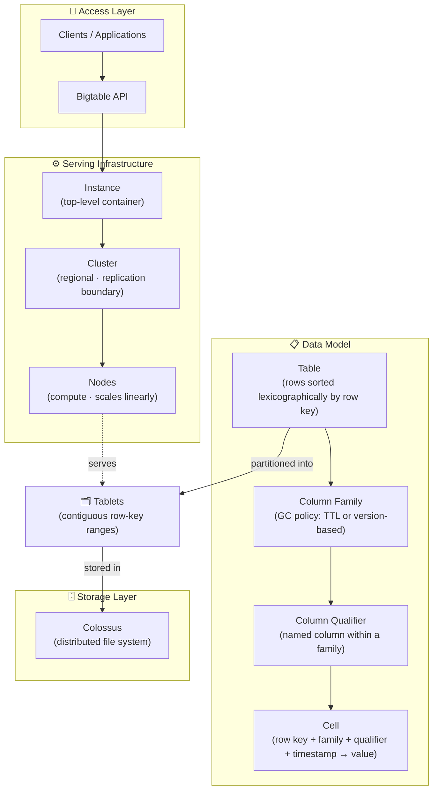
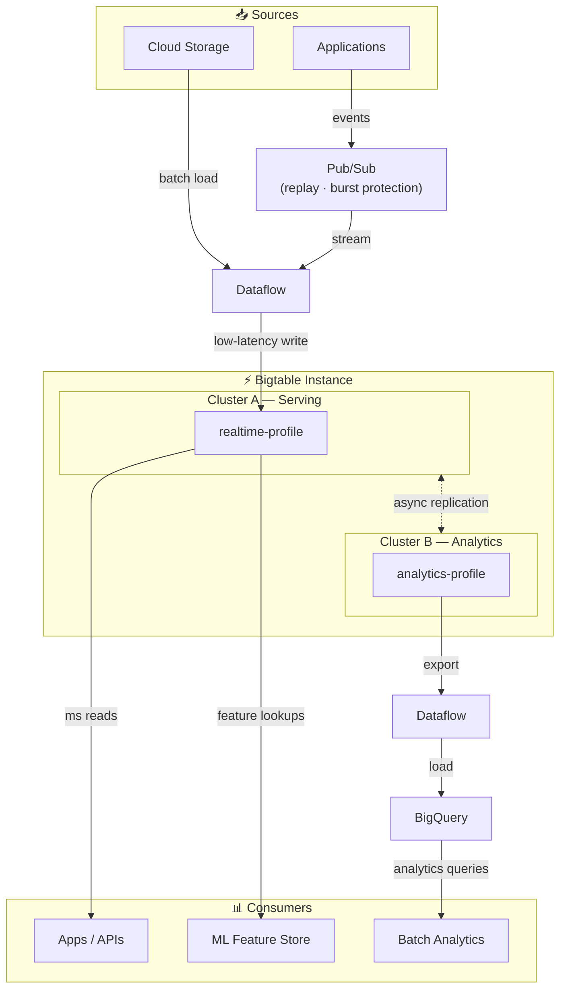

# Bigtable

Bigtable is GCP's managed wide-column database for high-throughput, low-latency access to large datasets. It excels at key-value and time-series workloads where you need predictable reads/writes at scale.

## Use Cases
- Serving layer for large, sparse datasets with millisecond latency.
- Time-series or IoT event storage with high write rates.
- Feature store or lookup tables for online applications and ML.
- Operational aggregates too hot for [[Storage/BigQuery|BigQuery]].
- Massive key-value datasets with high-throughput random reads and writes.

## Mental Model
- Rows are stored sorted lexicographically by row key and distributed by key range across tablets.
- A row is the atomic unit of read/write — no joins, no secondary indexes.
- Schema is flexible, but **row key design determines performance and scale** above everything else.
- Bigtable stores rows, not files or large blobs.
- Bigtable supports the **HBase API** — existing HBase/Cassandra-style workloads can migrate with minimal rewrite, same row-key design patterns apply.

## Data Model Hierarchy

| Level             | Description                                                                    |
| ----------------- | ------------------------------------------------------------------------------ |
| **Instance**      | Top-level container for all Bigtable resources                                 |
| **Cluster**       | Serving nodes within a region; supports replication across clusters            |
| **Node**          | Compute capacity for reads/writes; scales linearly                             |
| **Table**         | Rows keyed by row key, grouped into column families                            |
| **Column family** | Logical grouping of columns; unit of storage and GC policy                     |
| **Cell**          | Value at a (row key, column, timestamp) coordinate; can have multiple versions |

GC rules: TTL or version-based cleanup applied per column family.
- TTL GC is asynchronous, so it manages storage/cost but not immediate read blocking; use timestamp range filters to enforce strict "last N days" access.
- TTL is not a read-time filter; unlike BigQuery partition expiration, it won’t guarantee old rows are hidden—use timestamp range filters.
- Timestamp range filters enforce read-time limits even when old cells still exist physically.

## Row Key Design (Critical)

Good keys spread traffic evenly and match access patterns. Row key is part of every read/write — keep it short but meaningful.

**Anti-patterns:**
- Monotonically increasing keys (timestamps, sequential IDs) → all writes hit the same tablet.
- Lexically close keys generated close in time → same root cause.

**Recommended patterns:**

| Pattern                            | When To Use                                                       |
| ---------------------------------- | ----------------------------------------------------------------- |
| Reverse timestamp                  | Time-series where latest records are read most often              |
| Hash prefix                        | Distribute writes when key itself isn't the access pattern        |
| Composite key (`entity#timestamp`) | Range scans over an entity's history                              |
| UUID v4 prefix                     | Random distribution; avoid UUID v1 (time-based, still sequential) |

**How hot-spotting works:**
- Hot-spotting = workload skewed to a small number of nodes instead of distributed evenly.
- Bigtable distributes writes by **row key only** — not via a GCP load balancer.
- Replication does **not** affect where data is originally written; it only copies data after the fact.
- Column count does **not** affect distribution — Bigtable is wide-column by design.

**UUID v1 vs v4:**
- UUID v1 is time-based → sequential prefix → writes cluster on the same tablet, despite "looking" random.
- UUID v4 is fully random → writes spread evenly across key space.

## Data Modeling Tips
- Keep related columns in the same column family to reduce I/O.
- Favor sparse columns over wide rows when data is optional.
- Use cell versions for time-based retention instead of manual deletes.
- Model queries around primary key access and range scans — there are no secondary indexes.

## Ingestion And Processing
- Stream events via [[Ingestion/PubSub|Pub/Sub]] → [[Processing/Dataflow|Dataflow]] → Bigtable.
- Batch load from [[Cloud-Storage|Cloud Storage]] using Dataflow or bulk APIs.
- Use [[Processing/Dataproc|Dataproc]] for Spark jobs that read/write Bigtable at scale.
- Export or replicate into [[Storage/BigQuery|BigQuery]] for analytics.

## Performance And Cost
- Scale nodes for throughput — under-provisioning causes latency spikes, not errors.
- Keep storage utilization per node below 60% (latency-sensitive), 70% (throughput), 80% absolute max — exceeding triggers compaction and p99 spikes.
- Use column/version filters to limit data returned per read.
- Avoid large unparallelized range scans; split by key range for parallel reads.
- Set TTL GC rules per column family to control storage growth and cost.

**Node failure:**
- Bigtable automatically reassigns tablets to healthy nodes with no data loss — unlike Dataproc/HBase, node failover is fully managed.

**Storage type:**
- Fixed at instance creation: SSD (low latency, high throughput) or HDD (lower cost, higher latency).
- To switch types, create a new instance and migrate data — in-place toggle is not supported.

## Multi-Cluster Routing And App Profiles

Route workloads to dedicated clusters; data replicates automatically — no duplication needed.

**App profiles** map each workload to its cluster at connection time.

| App Profile         | Cluster   | Workload           |
| ------------------- | --------- | ------------------ |
| `realtime-profile`  | Cluster A | Live writes, reads             |
| `analytics-profile` | Cluster B | Export to BigQuery for analytics |

**Key points:**
- Eliminates OLTP vs. analytics resource contention.
- Each cluster scales independently.
- Automatic failover if a cluster goes down.
- Replication is async — Cluster B reads may be slightly stale.

## Security And Governance
- Least-privilege [[Security/IAM|IAM]] roles for admin vs data access.
- CMEK via [[Cloud-KMS|Cloud KMS]] if required.
- Enable audit logs to track admin activity and data access patterns.

## Common Pitfalls
- Poor row key design causing hot tablets — monotonically increasing keys (timestamps, UUID v1) funnel all writes to the same tablet; use reverse timestamps, hash prefixes, or composite keys to distribute load.
- Treating Bigtable like a relational database — no joins, secondary indexes, or cross-row transactions; all query patterns must be designed around row key access and range scans only.
- Unparallelized range scans on large tables — a single scanner runs on one node; split the key range into sub-ranges and scan in parallel to use multiple nodes.
- Missing GC rules causing unbounded storage growth — cells accumulate indefinitely without TTL or version-based GC rules per column family; set and validate GC policies at table design time.
- Relying on TTL as a read-time filter — TTL cleanup is asynchronous; old cells may still be physically present when read; use timestamp range filters to enforce strict access windows.
- Exceeding node storage thresholds — keeping utilization above 70–80% per node triggers compaction and p99 latency spikes; scale nodes before hitting the limit, not after.
- Storing large blobs or analytical files — degrades tablet performance and inflates storage cost; use [[Cloud-Storage|Cloud Storage]] for blobs, [[Storage/BigQuery|BigQuery]] for analytics.

## Quick Checklist
- Define access patterns and row key strategy before anything else.
-  Choose column families and configure GC rules (TTL or version-based).
-  Size nodes based on read/write throughput targets.
-  Plan ingestion path (Pub/Sub → Dataflow or batch load from GCS).
-  Set [[Security/IAM|IAM]] roles and CMEK requirements.
