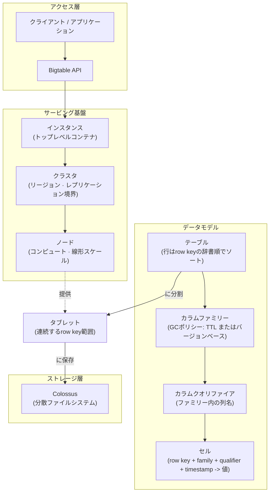
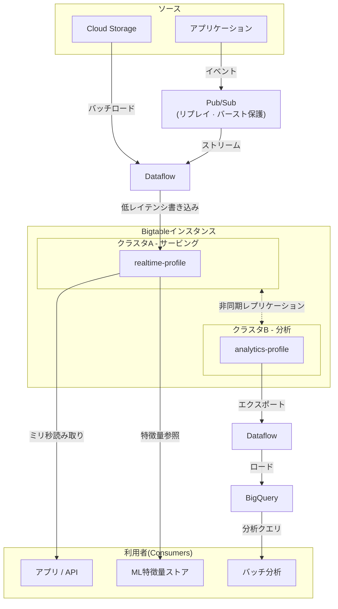

# Bigtable

Bigtable は、大規模データセットへの高スループット・低レイテンシアクセスを実現する、GCPマネージドのワイドカラムデータベースである。スケール下でも予測可能な読み書きが必要な、key-value と時系列ワークロードで強い。

## ユースケース
- ミリ秒レイテンシで、大規模かつスパースなデータセットを提供するサービング層。
- 高書き込みレートの時系列/IoTイベントストレージ。
- オンラインアプリ/ML向けの特徴量ストア、またはルックアップテーブル。
- [[Storage/BigQuery|BigQuery]] ではホットすぎる運用集計。
- 高スループットなランダム読み書きが必要な巨大key-valueデータセット。

## メンタルモデル
- 行はrow keyの辞書順でソートされ、キー範囲でtabletに分割されて分散配置される。
- 行は読み書きの原子単位である（joinなし、セカンダリインデックスなし）。
- スキーマは柔軟だが、何よりも **row key設計が性能とスケールを決める**。
- Bigtableが保存するのは行であり、ファイルや巨大blobではない。
- Bigtableは **HBase API** をサポートする。既存のHBase/Cassandra風ワークロードは最小限の書き換えで移行しやすく、row key設計パターンも同様に適用される。

## データモデル階層

| レベル             | 説明                                                                           |
| ----------------- | ------------------------------------------------------------------------------ |
| **Instance**      | Bigtableリソース全体の最上位コンテナ                                            |
| **Cluster**       | リージョン内のサービングノード群（クラスタ間レプリケーションに対応）             |
| **Node**          | 読み書きの計算キャパシティ（線形にスケール）                                     |
| **Table**         | row keyでキー付けされた行（column familyでグルーピング）                        |
| **Column family** | 列の論理グループ（保存とGCポリシーの単位）                                      |
| **Cell**          | （row key, column, timestamp）に対応する値（複数バージョンを持てる）             |

GCルール：column family単位で、TTLまたはバージョンベースのクリーンアップを適用する。
- TTL GCは非同期のため、ストレージ/コストは管理できるが即時に読み取りをブロックできない。「直近N日」の厳密なアクセス制限にはtimestamp range filtersを使う。
- TTLはread-timeフィルタではない。BigQueryのパーティション期限とは違い、古い行が隠れることは保証されない。timestamp range filtersを使う。
- timestamp range filtersは、古いcellが物理的に残っていてもread-timeの制限を強制できる。

## Row key設計（最重要）

良いキーはトラフィックを均等に分散し、アクセスパターンに一致する。row keyはすべてのread/writeに関わるため、短く、しかし意味を持たせる。

**アンチパターン:**
- 単調増加キー（タイムスタンプ、連続ID）→ すべての書き込みが同じタブレットに集中する。
- 時間的に近い生成のキー → 同じ根本原因。

**推奨パターン:**

| パターン                            | 使用時機                                                       |
| ---------------------------------- | ----------------------------------------------------------------- |
| リバースタイムスタンプ                  | 最新レコードを最も頻繁に読む時系列                               |
| ハッシュプレフィックス                        | キー自体がアクセスパターンではないが、書き込みを分散したい場合      |
| 複合キー (`entity#timestamp`) | エンティティの履歴に対するレンジスキャン                          |
| UUID v4 プレフィックス                     | ランダム分布。UUID v1（時間ベースで実質連番）は避ける              |

**ホットスポットが起きる仕組み:**
- ホットスポット = ワークロードが均等分散されず、少数ノードへ偏ること。
- Bigtableは **row keyのみ** で書き込みを分散する（GCPのロードバランサで分散されるわけではない）。
- レプリケーションは「最初に書き込まれる場所」には影響せず、後段でコピーするだけ。
- 列数は分散に影響しない（Bigtableはワイドカラム前提）。

**UUID v1 vs v4:**
- UUID v1 は時間ベース → 先頭が連番 → 「ランダムに見えても」同じtabletに書き込みが偏る。
- UUID v4 は完全ランダム → キー空間全体に均等に分散しやすい。

## データモデリングのヒント
- 関連列は同じcolumn familyにまとめ、I/Oを減らす。
- 任意データはワイド行よりスパース列を優先する。
- 手動削除よりcell versionsを使って時系列保持を実現する。
- クエリは主キーアクセスとレンジスキャンを前提に設計する（セカンダリインデックスはない）。

## 取り込みと処理
- イベントは [[Ingestion/PubSub|Pub/Sub]] → [[Processing/Dataflow|Dataflow]] → Bigtable でストリーミング投入する。
- [[Cloud-Storage|Cloud Storage]] からは、Dataflowまたはbulk APIでバッチロードする。
- 大規模にBigtableを読み書きするSparkジョブには [[Processing/Dataproc|Dataproc]] を使う。
- 分析用途では [[Storage/BigQuery|BigQuery]] へエクスポート/レプリケートする。

## 性能とコスト
- スループットのためにnodeをスケールする（過小プロビジョニングはエラーではなくレイテンシ急増として現れる）。
- ノードあたりのストレージ使用率は 60%未満（レイテンシ重視）、70%（スループット重視）、80%（絶対上限）を目安にする。超えるとcompactionが走り、p99が悪化する。
- 1回のreadで返すデータを、column/version filtersで絞る。
- 並列化されない大きなレンジスキャンを避ける。キー範囲で分割して並列に読む。
- ストレージ増加とコスト制御のため、column familyごとにTTL GCルールを設定する。

**Node failure:**
- Bigtableはデータ損失なく、tabletを健全ノードへ自動再割り当てする（Dataproc/HBaseと異なり、ノードフェイルオーバーはフルマネージド）。

**ストレージ種別：**
- インスタンス作成時に固定：SSD（低レイテンシ、高スループット）またはHDD（低コスト、高レイテンシ）。
- 種別を切り替えるには、新しいインスタンスを作成してデータ移行する（インプレース切り替えは非対応）。

## マルチクラスタルーティングとApp profiles

ワークロードを専用クラスタにルーティングする。データは自動的にレプリケートされ、重複は不要。

**App profiles** は、接続時に各ワークロードをそのクラスタにマッピングする。

| App Profile         | クラスタ   | ワークロード           |
| ------------------- | --------- | ------------------ |
| `realtime-profile`  | クラスタA | ライブ書き込み、読み取り             |
| `analytics-profile` | クラスタB | BigQueryへのエクスポート分析 |

**主要なポイント：**
- OLTP vs分析リソース競合を排除する。
- 各クラスタは独立してスケールする。
- クラスタがダウンした場合の自動フェイルオーバー。
- レプリケーションは非同期のため、クラスタBの読み取りはわずかに古くなりうる。

## セキュリティとガバナンス
- admin と data access で役割を分け、最小権限の [[Security/IAM|IAM]] ロールを付与する。
- 必要なら [[Cloud-KMS|Cloud KMS]] 経由でCMEKを使う。
- 監査ログを有効化し、管理操作とデータアクセスのパターンを追跡する。

## よくある落とし穴
- row key設計が悪いとホットタブレットが発生 — 単調増加キー（タイムスタンプ、UUID v1）はすべての書き込みを同じタブレットに集約する。リバースタイムスタンプ、ハッシュプレフィックス、複合キーを使って負荷を分散させる。
- Bigtableをリレーショナルデータベースのように扱う — joinなし、セカンダリインデックスなし、クロス行トランザクションなし。すべてのクエリパターンはrow keyアクセスとレンジスキャンのみで設計される。
- 並列化されていない大規模テーブルのレンジスキャン — 1つのスキャナーは1つのノードで実行される。キー範囲をサブレンジに分割して並列スキャンし、複数ノードを使う。
- GCルール欠落による無制限のストレージ増加 — column family単位でTTLまたはバージョンベースのGCルールがないと、セルが無期限に蓄積される。テーブル設計時にGCポリシーを設定・検証する。
- TTLをread-timeフィルタとして扱う — TTLクリーンアップは非同期のため、読み取り時に古いcellが物理的に残ることがある。厳密なアクセス窓はtimestamp range filtersで強制する。
- ノードストレージしきい値を超える — ノードあたり使用率70～80%を超えるとcompactionが発動してp99レイテンシが急増する。しきい値に達する前にノードをスケールする。
- 大きなblob や分析ファイルを保存する — タブレット性能が低下しストレージコストが増加する。blob には [[Cloud-Storage|Cloud Storage]]、分析には [[Storage/BigQuery|BigQuery]] を使う。

## クイックチェックリスト
- 何より先に、アクセスパターンとrow key戦略を定義する。
- column families を選び、GCルール（TTLまたはバージョンベース）を設定する。
- 読み書きスループット目標に基づいてnodeをサイジングする。
- 取り込み経路（Pub/Sub → Dataflow、またはGCSからのバッチロード）を計画する。
- [[Security/IAM|IAM]] ロールとCMEK要件を設定する。
