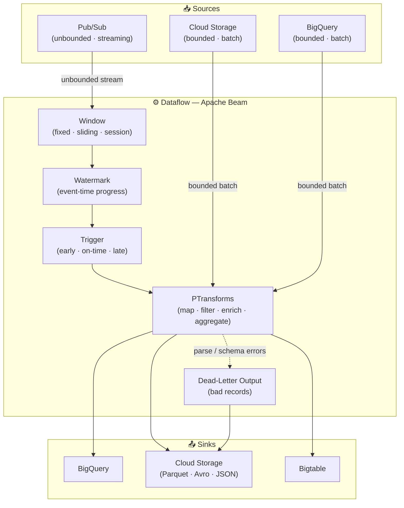

# Dataflow

Dataflow is GCP's managed Apache Beam service — unified batch and streaming pipelines, autoscaling workers, no infrastructure to manage.

## Use Cases
- Stream processing from [[Ingestion/PubSub|Pub/Sub]] or [[Cloud-Storage|Cloud Storage]] into curated sinks (often [[Storage/BigQuery|BigQuery]]).
- Batch ETL for large backfills or daily rebuilds with parallel transforms.
- Event-time analytics with windowing, late data handling, and stateful aggregations.
- Data enrichment joins across datasets without managing Spark clusters.

## Mental Model
- A pipeline is a DAG of transforms applied to PCollections of records.
- The runner (Dataflow) decides how to parallelize and scale the graph across workers.
- Streaming is event-time first: watermarks, windows, and triggers define output timing.
- Correctness depends on keys, windowing, and idempotent sinks — not just code.

## Core Concepts

| Concept           | Description                                                                |
| ----------------- | -------------------------------------------------------------------------- |
| Pipeline          | Your Beam graph and options (project, region, temp GCS path)               |
| PCollection       | Immutable collection of elements; bounded (batch) or unbounded (streaming) |
| Keyed PCollection | `GroupByKey`/`CombinePerKey` require `PCollection<KV<K,V>>`                |
| PTransform        | A step in the graph (map, filter, group, join, write)                      |
| DoFn              | Per-element user code; use for streaming/side outputs vs BigQuery UDF (set-based SQL) |
| Runner            | Execution engine — Dataflow in GCP                                         |
| Worker            | VM/container executing pipeline steps                                      |
| Job               | A running instance of a pipeline on Dataflow                               |
| Template          | Pre-built job spec for repeatable runs (classic or Flex Template)          |

> For keyed aggregations, shape data as `PCollection<KV<K,V>>` first and prefer `CombinePerKey` over `GroupByKey` when possible.

## Batch vs Streaming

|                  | Batch                        | Streaming                                         |
| ---------------- | ---------------------------- | ------------------------------------------------- |
| **Data**         | Bounded                      | Unbounded                                         |
| **Sources**      | GCS, BigQuery                | Pub/Sub, Kafka, change streams                    |
| **Windowing**    | Not needed                   | Required for aggregations                         |
| **Delivery**     | Exactly-once                 | At-least-once; exactly-once depends on sink semantics |

## Pipeline Architecture



## Windowing, Watermarks, And Triggers

| Window Type       | Behaviour                                          | Use For                                                         |
| ----------------- | -------------------------------------------------- | --------------------------------------------------------------- |
| Fixed (tumbling)  | Non-overlapping; each event in exactly one window  | Periodic metrics (per minute/hour)                              |
| Sliding (hopping) | Overlapping; events can appear in multiple windows | Rolling metrics (e.g. avg over past hour, updated every minute) |
| Session           | Variable-length; closes after a gap of inactivity  | User behaviour, non-continuous streams                          |

- **Watermark**: system estimate of event-time progress.
- **Allowed lateness**: how long to accept late-arriving events.
- **Triggers**: when to emit results (on watermark, early, or late).
- Keep triggers simple if outputs must be stable; handle late data explicitly.
- For late data, use Dataflow allowed lateness/watermarks

## Keys, State, And Timers
- Keys define parallelism and aggregation boundaries.
- Per-key state and timers enable sessionization, dedupe, and complex joins.
- Skewed keys bottleneck the pipeline — watch for "hot keys".

## Sources And Sinks

**Sources:** [[Ingestion/PubSub|Pub/Sub]] · [[Cloud-Storage|Cloud Storage]] · [[Storage/BigQuery|BigQuery]] · [[OperationalDBs/Bigtable|Bigtable]] · [[OperationalDBs/Spanner|Spanner]] · Kafka

**Sinks:** [[Storage/BigQuery|BigQuery]] · [[Cloud-Storage|Cloud Storage]] (Parquet/Avro/JSON) · [[OperationalDBs/Bigtable|Bigtable]] · [[OperationalDBs/Spanner|Spanner]] · [[Ingestion/PubSub|Pub/Sub]]

## Development And Deployment
- Write pipelines in Java/Python/Go; test locally with the DirectRunner.
- Run on Dataflow for managed, scalable execution.
- Use templates (classic or Flex) for repeatable jobs with runtime parameters.
- Keep temp and staging paths in [[Cloud-Storage|Cloud Storage]] — regional alignment matters.

## Example Pattern (Pub/Sub → Windowed Aggregate → BigQuery)
```python
with beam.Pipeline(options=opts) as p:
    (p
     | "Read"      >> beam.io.ReadFromPubSub(topic=topic)
     | "Parse"     >> beam.Map(parse_event)
     | "Key"       >> beam.Map(lambda e: (e.user_id, e))
     | "Window"    >> beam.WindowInto(beam.window.FixedWindows(60))
     | "Aggregate" >> beam.CombinePerKey(combine_metrics)
     | "ToBQ"      >> beam.io.WriteToBigQuery(table, write_disposition="WRITE_APPEND"))
```

## Performance And Cost
- Favor `Combine` over `GroupByKey` to reduce shuffle volume.
- Shuffle-heavy transforms (`GroupByKey`, `CoGroupByKey`) drive cost and time.
- Autoscaling handles spiky workloads but can add cold-start latency.
- Worker caps use `--maxNumWorkers`; Dataproc/GKE autoscaling settings don’t apply to Dataflow workers.
- Streaming Engine reduces worker load at extra cost — evaluate with real traffic.
- Worker sizing: start with defaults, tune machine type and disk from there.

**High-QPS external calls:**
- Use `FixedWindows` + `GroupIntoBatches` (or `BatchElements`) with max batch size/bytes and max delay.
- Call the API once per batch with retries — avoids per-element HTTP overhead.

**FlexRS:**
- For non-urgent batch jobs only — not for streaming or strict SLAs.
- Tradeoff: delayed start and longer runtime for lower cost.

## Stage Fusion And Reshuffle
- **What fusion is:** Dataflow may merge adjacent transforms into one stage, so per-step metrics and parallelism are hidden.
- **Example (problem):** `Pub/Sub → read GCS file → emit rows` can run as one fused stage on a single worker.
- **Why it hurts scaling:** parallelism becomes “messages/files,” not “rows,” so autoscaling may see little backlog even for huge files.
- **Visible symptom:** one large file is processed by one worker, even if it contains millions of rows.
- **What `Reshuffle` does:** forces a shuffle boundary, creating a new stage with independent CPU/backlog/throughput metrics.
- **Example (fix):** `Pub/Sub → read file → Reshuffle → process rows` lets rows fan out across workers.
- **Rule of thumb:** use `Reshuffle` only when fusion blocks parallelism or for debugging; extra shuffles add latency and cost.

## Reliability Patterns
- Make outputs idempotent (deterministic keys, upserts, partition overwrites).
- Use dead-letter outputs for bad records so the pipeline keeps moving.
- Prefer **drain** over cancel for streaming changes — drain stops gracefully and preserves in-flight/windowed data; cancel drops it.

**Live pipeline updates:**
- Use `--update` to preserve in-flight data and state; drain/cancel + redeploy risks state reset.
- If transform names changed, include `--transformNameMapping` or Dataflow treats them as new transforms and drops state.

**Key streaming metrics:**

| Metric                   | Answers                                                   |
| ------------------------ | --------------------------------------------------------- |
| `job/system_lag`         | Max time any element is waiting (worst backlog right now) |
| `job/data_watermark_age` | Event-time progress / data freshness                      |


## Regional Availability
- Dataflow is a regional service; jobs run across multiple zones within the region.
- `--region=...` enables zonal failover — workers reschedule in healthy zones automatically.
- Mitigates single-zone failures; region-level outages still impact the job.

## Security And Governance
- Use service accounts with least-privilege IAM for sources/sinks.
- Keep data locality consistent (region and data residency).
- Use [[Security/DLP|DLP]] de-identification (masking/redaction) when producing analytics-ready data.
- CMEK supported for customer-managed key requirements.
- If org policy forbids external IPs, **enable Private Google Access on the subnet** so Dataflow workers can reach **GCS/BQ APIs**; VPC-SC/firewall rules don’t replace this.

## Common Pitfalls
- Hot keys bottlenecking a single worker — skewed key distribution funnels all work to one thread; salt keys or pre-aggregate with `CombinePerKey` before grouping.
- Excessive small files from GCS sinks — high metadata overhead and slow downstream reads; tune `num_shards` or use byte-size write triggers.
- Unbounded side inputs in streaming jobs — side inputs are fully reloaded per bundle and cannot grow indefinitely; use a bounded, periodically refreshed source or per-key state instead.
- Misaligned regions across Dataflow, [[Cloud-Storage|Cloud Storage]], and [[Storage/BigQuery|BigQuery]] — causes cross-region data egress costs and added latency; co-locate all resources in the same region.
- Aggregating streaming data without a window — unbounded PCollections cannot be grouped without `WindowInto`; the step never fires or throws at runtime.
- Late data silently dropped — Dataflow drops elements past the watermark by default; set `allowed_lateness` on the window to accept and re-fire for late records.
- Mixing up `system_lag` and `data_watermark_age` — `system_lag` is worst-case element wait time (backlog depth); `data_watermark_age` is event-time freshness; they answer different questions.

## Integrations
- [[Storage/BigQuery|BigQuery]]: batch loads, streaming via Storage Write API, or file loads from GCS.
- [[Cloud-Storage|Cloud Storage]]: staging/temp, batch sources, and final data lake outputs.
- [[Ingestion/PubSub|Pub/Sub]]: common streaming input/output bus.
- [[Ingestion/Datastream|Datastream]] / CDC tools: stream into Dataflow for transformation and routing.
- For high‑frequency analytics off Cloud SQL, use **Datastream → BigQuery** to offload OLTP reads; use **Dataflow** only when you need transformation/routing.

## Pipeline Handoff

| Use Case | Preferred Service | Reason |
| --- | --- | --- |
| Batch or intermediate files between pipelines | [[Cloud-Storage\|Cloud Storage]] | Durable shared store, large-scale file output, and simple IAM sharing |
| Low-latency event handoff | [[Ingestion/PubSub\|Pub/Sub]] | Streaming bus for near-real-time message delivery |

- Dataflow pipeline A cannot directly pass runtime data to pipeline B; both must read/write through an external service.
- **Common trap:** selecting "direct Dataflow-to-Dataflow transfer" as an architecture option.

## Quick Checklist
-  Choose region and align with [[Cloud-Storage|Cloud Storage]] / [[Storage/BigQuery|BigQuery]] datasets.
-  Decide batch vs streaming; define windowing strategy if streaming.
-  Define idempotent sinks and error handling (dead-letter) paths.
-  Size workers and enable autoscaling; monitor for skew/hot keys.
-  Use templates for repeatability and parameterized runs.
-  Add monitoring: logs, custom metrics, and alerting on lag.
