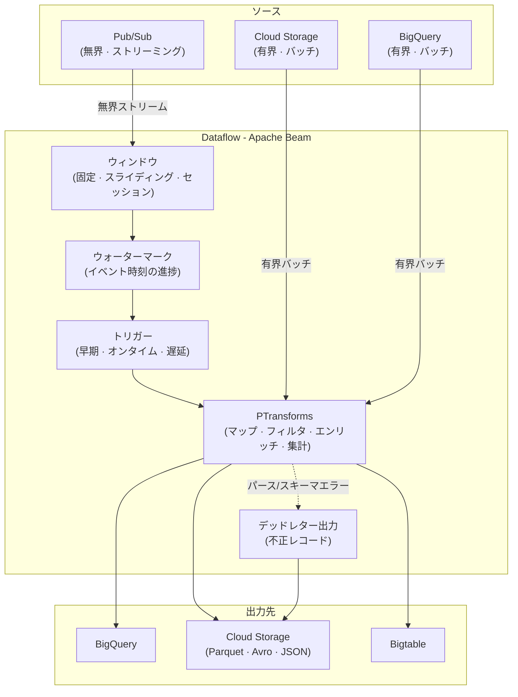

# Dataflow

Dataflow は、GCPのマネージド Apache Beam サービスである。バッチ/ストリーミングを統一したパイプライン、ワーカーのオートスケール、管理すべきインフラ不要が特徴。

## ユースケース
- [[Ingestion/PubSub|Pub/Sub]] または [[Cloud-Storage|Cloud Storage]] から、キュレート済みシンク（多くは [[Storage/BigQuery|BigQuery]]）へストリーム処理する。
- 大規模バックフィルや日次リビルドのための、並列変換を伴うバッチETL。
- ウィンドウ、遅延データ処理、ステートフル集計を用いたイベント時刻（event-time）分析。
- Sparkクラスタを運用せずに、データセット間のエンリッチ結合を行う。

## メンタルモデル
- パイプラインは、レコードの PCollections に transform を適用するDAGである。
- runner（Dataflow）が、グラフをワーカーにどう並列化し、どうスケールさせるかを決める。
- ストリーミングはevent-time優先：watermark、window、trigger が出力タイミングを定義する。
- 正しさはコードだけでなく、キー、ウィンドウ、冪等なシンクに依存する。

## コア概念

| 概念              | 説明                                                                       |
| ----------------- | -------------------------------------------------------------------------- |
| Pipeline          | Beamのグラフとオプション（project、region、一時GCSパス）                    |
| PCollection       | 不変の要素コレクション（有界=バッチ / 無界=ストリーミング）                 |
| Keyed PCollection | `GroupByKey`/`CombinePerKey` は `PCollection<KV<K,V>>` が必要               |
| PTransform        | グラフの1ステップ（map、filter、group、join、write）                        |
| DoFn              | 要素ごとのユーザーコード（ストリーミング/side outputs向け。BigQuery UDFは集合指向SQL） |
| Runner            | 実行エンジン（GCPではDataflow）                                             |
| Worker            | パイプラインステップを実行するVM/コンテナ                                   |
| Job               | Dataflow上で動くパイプラインの実行インスタンス                               |
| Template          | 反復実行用の事前構築ジョブ仕様（classic / Flex Template）                    |

> キー付き集計では、まず `PCollection<KV<K,V>>` の形に整え、可能なら `GroupByKey` より `CombinePerKey` を優先する。

## バッチ vs ストリーミング

|                  | バッチ                        | ストリーミング                                      |
| ---------------- | ---------------------------- | ------------------------------------------------- |
| **データ**         | 有界                         | 無界                                              |
| **ソース**         | GCS, BigQuery                | Pub/Sub, Kafka, change streams                    |
| **ウィンドウ**      | 不要                         | 集計では必須                                       |
| **配信**           | Exactly-once                 | At-least-once（exactly-onceはシンクの性質に依存）  |

## パイプライン構成



## ウィンドウ、ウォーターマーク、トリガー

| ウィンドウ種別      | 挙動                                               | 用途                                                             |
| ----------------- | -------------------------------------------------- | --------------------------------------------------------------- |
| Fixed (tumbling)  | 非重複（各イベントはちょうど1つのウィンドウに属する） | 定期メトリクス（分/時）                                          |
| Sliding (hopping) | 重複（イベントが複数ウィンドウに入りうる）           | ローリングメトリクス（例：過去1時間平均を毎分更新）               |
| Session           | 可変長（非アクティブのギャップ後にクローズ）         | ユーザー行動、非連続ストリーム                                    |

- **ウォーターマーク**: event-time進捗に関するシステム推定。
- **許容遅延（Allowed lateness）**: 遅延到着イベントを受け入れる期間。
- **トリガー**: 結果を出すタイミング（watermark、early、late）。
- 出力を安定させる必要があるなら、triggerは単純にし、遅延データは明示的に扱う。
- 遅延データにはDataflowの allowed lateness / watermarks を使う。

## キー、ステート、タイマー
- キーが並列性と集計境界を決める。
- キー単位のステートとタイマーで、セッション化、重複排除、複雑な結合が可能になる。
- キー偏りはパイプラインのボトルネックになる（hot keysに注意）。

## ソースとシンク

**ソース:** [[Ingestion/PubSub|Pub/Sub]] · [[Cloud-Storage|Cloud Storage]] · [[Storage/BigQuery|BigQuery]] · [[OperationalDBs/Bigtable|Bigtable]] · [[OperationalDBs/Spanner|Spanner]] · Kafka

**シンク:** [[Storage/BigQuery|BigQuery]] · [[Cloud-Storage|Cloud Storage]]（Parquet/Avro/JSON） · [[OperationalDBs/Bigtable|Bigtable]] · [[OperationalDBs/Spanner|Spanner]] · [[Ingestion/PubSub|Pub/Sub]]

## 開発とデプロイ
- パイプラインを Java/Python/Go で書き、DirectRunnerでローカルテストする。
- マネージドでスケーラブルに実行するため、Dataflow上で動かす。
- ランタイムパラメータ付きの反復実行にはテンプレート（classic / Flex）を使う。
- temp/staging のパスは [[Cloud-Storage|Cloud Storage]] に置く（リージョン整合が重要）。

## 例パターン（Pub/Sub → ウィンドウ集計 → BigQuery）
```python
with beam.Pipeline(options=opts) as p:
    (p
     | "Read"      >> beam.io.ReadFromPubSub(topic=topic)
     | "Parse"     >> beam.Map(parse_event)
     | "Key"       >> beam.Map(lambda e: (e.user_id, e))
     | "Window"    >> beam.WindowInto(beam.window.FixedWindows(60))
     | "Aggregate" >> beam.CombinePerKey(combine_metrics)
     | "ToBQ"      >> beam.io.WriteToBigQuery(table, write_disposition="WRITE_APPEND"))
```

## 性能とコスト
- shuffle量を減らすため、`GroupByKey` より `Combine` を優先する。
- shuffle負荷の大きいtransform（`GroupByKey`, `CoGroupByKey`）がコストと時間を押し上げる。
- オートスケールはスパイクに強いが、コールドスタートのレイテンシが増えうる。
- ワーカー上限は `--maxNumWorkers` を使う（Dataproc/GKEのオートスケール設定はDataflowワーカーに適用されない）。
- Streaming Engine は追加コストでワーカー負荷を下げる（実トラフィックで評価する）。
- ワーカーサイジング：まず既定から始め、マシンタイプとディスクを調整する。

**高QPSな外部呼び出し:**
- 最大バッチサイズ/バイトと最大遅延を設定し、`FixedWindows` + `GroupIntoBatches`（または `BatchElements`）を使う。
- リトライ込みで「バッチあたり1回」APIを呼ぶ（要素ごとのHTTPオーバーヘッドを避ける）。

**FlexRS:**
- 緊急でないバッチジョブ専用（ストリーミングや厳格なSLAには不向き）。
- トレードオフ：起動が遅れ、実行時間が長くなる代わりに低コスト。

## ステージフュージョンとReshuffle
- **fusionとは:** Dataflowは隣接するtransformを1つのステージに統合することがあり、ステップ単位の指標と並列性が見えにくくなる。
- **例（問題）:** `Pub/Sub → read GCS file → emit rows` が、単一ワーカー上の1ステージとして動きうる。
- **なぜスケールを阻害するか:** 並列性が「行」ではなく「メッセージ/ファイル」になり、巨大ファイルでもバックログが小さく見えてオートスケールが効きにくい。
- **見える症状:** 数百万行を含む大きなファイルでも、1ワーカーで処理される。
- **`Reshuffle` の効果:** shuffle境界を強制し、独立したCPU/バックログ/スループット指標を持つ新しいステージを作る。
- **例（解決）:** `Pub/Sub → read file → Reshuffle → process rows` で、行をワーカーへ扇状に分散できる。
- **経験則:** `Reshuffle` はfusionが並列性を塞ぐ場合、またはデバッグ用途に限定する（余分なshuffleはレイテンシとコストを増やす）。

## 信頼性パターン
- 出力を冪等にする（決定的キー、upsert、パーティション上書き）。
- 不正レコードはデッドレター出力に逃がし、パイプラインを止めない。
- ストリーミング変更は cancel より **drain** を優先する（drainは優雅に停止し、in-flight/ウィンドウ中データを保持する。cancelは破棄する）。

**Live pipeline updates:**
**ライブパイプライン更新:**
- in-flightデータとステートを保持するため `--update` を使う（drain/cancel + 再デプロイはステートリセットのリスク）。
- transform名が変わった場合は `--transformNameMapping` を含める。そうしないとDataflowは新規transformとみなし、ステートを破棄する。

**Key streaming metrics:**

| 指標                      | 分かること                                                |
| ------------------------ | --------------------------------------------------------- |
| `job/system_lag`         | 要素が待っている最大時間（いま最悪のバックログ）            |
| `job/data_watermark_age` | event-time進捗 / データ鮮度                                |


## リージョン提供
- Dataflowはリージョンサービスで、ジョブはリージョン内の複数ゾーンにまたがって動く。
- `--region=...` によりゾーンフェイルオーバーが有効になり、ワーカーは健全なゾーンへ自動的に再スケジュールされる。
- 単一ゾーン障害は緩和できるが、リージョン障害はジョブに影響する。

## セキュリティとガバナンス
- ソース/シンクには最小権限のIAMを持つサービスアカウントを使う。
- データローカリティ（リージョン/データレジデンシー）を揃える。
- 分析可能データ（analytics-ready）を生成する場合、[[Security/DLP|DLP]] の匿名化（masking/redaction）を使う。
- 顧客管理鍵要件ではCMEKを使える。
- 組織ポリシーで外部IPが禁止なら、Dataflowワーカーが **GCS/BQ APIs** へ到達できるよう **サブネットでPrivate Google Accessを有効化** する（VPC-SC/ファイアウォールでは代替できない）。

## よくある落とし穴
- hot keys が単一ワーカーをボトルネックにする — キー分布の偏りで作業が1スレッドに集中する。キーのソルト化、またはgrouping前に `CombinePerKey` で事前集計する。
- GCSシンクからの小さいファイルが多すぎる — メタデータオーバーヘッドが大きく、下流の読み取りが遅い。`num_shards` を調整するか、バイトサイズの書き込みトリガーを使う。
- ストリーミングジョブで無界なside inputsを使う — side inputsはbundleごとに再読み込みされ、無限に成長できない。代わりに、有界で定期リフレッシュされるソース、またはキー単位ステートを使う。
- Dataflow / [[Cloud-Storage|Cloud Storage]] / [[Storage/BigQuery|BigQuery]] のリージョン不一致 — クロスリージョンのエグレスコストとレイテンシ増を招く。すべて同一リージョンに揃える。
- ウィンドウなしでストリーミングを集計する — 無界PCollectionsは `WindowInto` なしにgroupできない（ステップが発火しない/実行時エラーになる）。
- 遅延データが黙って捨てられる — 既定ではwatermarkを過ぎた要素はドロップされる。windowに `allowed_lateness` を設定し、遅延レコードを受け入れて再発火させる。
- `system_lag` と `data_watermark_age` を混同する — `system_lag` は最悪ケースの待ち時間（バックログ深さ）、`data_watermark_age` はevent-timeの鮮度で、別の問いに答える。

## 連携
- [[Storage/BigQuery|BigQuery]]：バッチロード、Storage Write APIによるストリーミング、またはGCSからのファイルロード。
- [[Cloud-Storage|Cloud Storage]]：staging/temp、バッチソース、データレイク最終出力。
- [[Ingestion/PubSub|Pub/Sub]]：一般的なストリーミングの入出力バス。
- [[Ingestion/Datastream|Datastream]] / CDCツール：変換/ルーティングのためにDataflowへ流す。
- Cloud SQLの高頻度分析では、OLTP読み取りをオフロードするため **Datastream → BigQuery** を使い、変換/ルーティングが必要な場合のみ **Dataflow** を使う。

## パイプラインの受け渡し

| ユースケース | 推奨サービス | 理由 |
| --- | --- | --- |
| パイプライン間のバッチ/中間ファイル | [[Cloud-Storage\|Cloud Storage]] | 耐久性のある共有ストア、大規模ファイル出力、単純なIAM共有 |
| 低レイテンシのイベント受け渡し | [[Ingestion/PubSub\|Pub/Sub]] | ほぼリアルタイム配信のためのストリーミングバス |

- DataflowパイプラインAは、実行時データをパイプラインBへ直接渡せない。両者は外部サービスを介して読み書きする必要がある。
- **よくある罠:** アーキテクチャ選択肢として「DataflowからDataflowへ直接転送」を選ぶ。

## クイックチェックリスト
-  リージョンを選び、[[Cloud-Storage|Cloud Storage]] / [[Storage/BigQuery|BigQuery]] のデータセットと揃える。
-  バッチかストリーミングかを決め、ストリーミングならウィンドウ戦略を定義する。
-  冪等なシンクと、エラーハンドリング（デッドレター）経路を定義する。
-  ワーカーをサイジングしてオートスケールを有効化し、偏り/hot keysを監視する。
-  反復実行とパラメータ実行のためにテンプレートを使う。
-  監視（ログ、カスタムメトリクス、ラグのアラート）を追加する。
