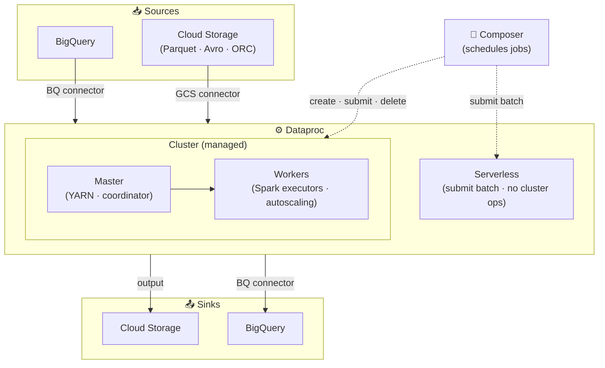

# Dataproc

Dataproc is GCP's managed service for running Apache Spark, Hadoop, and related big data tools. It provides fast cluster provisioning with integration to [[Cloud-Storage|Cloud Storage]] and [[Storage/BigQuery|BigQuery]] so you can run distributed batch processing without managing the full stack yourself.

## Use Cases
- Large-scale batch ETL/ELT using Spark (PySpark/Scala).
- Legacy Hadoop ecosystem workloads (Hive, Pig) that still need to run.
- Ad-hoc exploration or one-off backfills that don't fit [[Processing/Dataflow|Dataflow]].
- ML feature engineering with Spark on large datasets.

## Mental Model
- You manage clusters (nodes, autoscaling), but not the underlying infra.
- Storage is decoupled: persistent data lives in [[Cloud-Storage|Cloud Storage]] or [[Storage/BigQuery|BigQuery]], not on cluster disk.
- Jobs are submitted to clusters; clusters can be ephemeral or long-lived.
- Performance depends on data locality, shuffle size, and cluster sizing.

## Core Concepts

| Concept | Description |
| --- | --- |
| **Cluster** | Collection of VMs running Spark/Hadoop services |
| **Master/Worker** | Master coordinates jobs; workers execute tasks |
| **Job** | A submitted Spark/Hadoop workload |
| **Autoscaling** | Adjusts worker count based on YARN metrics |
| **Initialization actions** | Scripts that run at cluster creation to customize setup |
| **Workflow templates** | Define multi-job pipelines with parameters and dependencies |
| **Cluster properties** | `--properties` flag sets Spark/Hadoop/Dataproc config at creation time |

**Cluster properties example** — limit concurrent jobs at the scheduler level:
```bash
gcloud dataproc clusters create my-cluster \
  --properties=dataproc:dataproc.scheduler.max-concurrent-jobs=5
```

## Job Execution Architecture



## Cluster Types

| Type | When To Use |
| --- | --- |
| **Single-node** | Dev/testing and lightweight jobs |
| **Standard** | Production batch workloads (master + workers) |
| **Ephemeral** | Create → run jobs → delete; lowest cost for intermittent workloads |

## Job Types

| Type                  | Notes                                           |
| --------------------- | ----------------------------------------------- |
| Spark (PySpark/Scala) | Most common for data engineering                |
| Hadoop MapReduce      | Legacy processing                               |
| Hive                  | SQL on Hadoop datasets (less common on GCP now) |
| Presto/Trino          | Ad-hoc SQL via custom setup                     |

## Storage And Data Access
- [[Cloud-Storage|Cloud Storage]] is the default data lake for Spark/Hadoop via the GCS connector.
- [[Storage/BigQuery|BigQuery]] connector allows Spark to read/write tables directly.
- Avoid storing data on local disk beyond the job lifecycle — it disappears with the cluster.
- For high I/O workloads, add a small persistent disk to improve spill/shuffle performance.

## Dataproc Metastore

Dataproc Metastore is GCP's fully managed Apache Hive Metastore (HMS) service. It acts as a central metadata repository — storing table schemas, partition locations, and storage paths — that persists independently of cluster lifecycle.

- **Why it matters:** Ephemeral clusters lose their embedded metastore on deletion. Dataproc Metastore survives cluster recreation and is shareable across multiple clusters.
- **Use when:** Multiple Dataproc clusters need to share table definitions, or metadata must persist across ephemeral cluster lifecycles.
- Integrates with Spark SQL, Hive, and Presto/Trino jobs running on Dataproc.
- [[Governance/Dataplex|Dataplex]] can use it as a technical metadata catalog for unified governance across the data lake.

## Hadoop Modernization
When migrating on-prem Hadoop to GCP with minimal orchestration changes:
- Move workloads to Dataproc for Spark/Hadoop compatibility with minimal code changes.
- Replace HDFS with [[Cloud-Storage|Cloud-Storage]] via the GCS connector (removes NameNode and replication overhead).
- Keep existing Airflow DAGs by moving them to [[Cloud-Composer|Cloud-Composer]].
- Rewriting to Dataflow/Beam or Data Fusion is a larger redesign — not "minimal change."

## Performance And Cost
- Right-size workers: CPU vs memory profiles matter for Spark workload types.
- Use autoscaling for variable workloads; set sensible min/max bounds.
- Shuffle-heavy jobs drive most time and cost — optimize joins and partitioning.
- Prefer columnar formats (Parquet/ORC) with predicate pushdown.
- Use preemptible/spot workers for cost savings (requires retry logic for evictions).

## Reliability And Operations
- Monitor YARN/Spark UI for data skew and executor failures.
- Plan for cluster recreation if long-lived clusters drift in configuration.
- Use ephemeral clusters where possible to avoid configuration drift entirely.

## DR Pattern (Dual-Region GCS + Turbo Replication)
- Turbo Replication on dual-region buckets provides ~15-minute RPO for objects.
- Run the Dataproc cluster in the same region as the active GCS replica.
- On regional failure: redeploy the cluster in the other region — data is already replicated in the same bucket.
- Multi-region buckets and hourly transfer schedules do **not** guarantee a 15-minute RPO.

## Security And Governance
- Service accounts with least-privilege [[Security/IAM|IAM]] for job execution.
- Enable CMEK if required for data-at-rest encryption.
- Keep clusters in the same region as [[Cloud-Storage|Cloud-Storage]] and [[Storage/BigQuery|BigQuery]] data.
- For hardware isolation/compliance, run Dataproc on **sole‑tenant nodes**; standard/Confidential VMs don’t guarantee dedicated physical hosts.

## Common Pitfalls
- Overprovisioned clusters for small or intermittent jobs — idle workers accumulate cost; use ephemeral clusters (create → run → delete) or Dataproc Serverless instead.
- Storing critical data on local HDFS — data disappears when the cluster is deleted; always write outputs to [[Cloud-Storage|Cloud Storage]] or [[Storage/BigQuery|BigQuery]].
- Hot partitions causing skew and slow stages — a single executor handles the hot key while others sit idle; repartition or salt keys before aggregating.
- Large shuffles from wide joins or poor partitioning — drives most of job runtime and cost; filter early, use columnar formats, and broadcast small tables instead of joining.
- Autoscaling during shuffle-heavy stages — the scaler can remove workers mid-shuffle, causing task failures and retries; disable autoscaling for shuffle-intensive jobs or switch to Dataflow.
- Region mismatch between cluster and [[Cloud-Storage|Cloud Storage]] — causes cross-region egress cost and added latency; always co-locate cluster and data buckets.
- Long-lived clusters accumulating configuration drift — packages and init actions applied manually diverge over time; prefer ephemeral clusters or custom images for reproducibility.

## Integrations
- [[Cloud-Storage|Cloud-Storage]]: primary storage layer for input/output.
- [[Storage/BigQuery|BigQuery]]: analytics warehouse sink/source via connector.
- [[Cloud-Composer|Cloud-Composer]]: orchestrate multi-step Dataproc jobs via Airflow operators.
- [[Processing/Dataflow|Dataflow]]: alternative for managed pipelines without cluster ops.

## Quick Checklist
- Choose cluster type: ephemeral (create → run → delete) for intermittent jobs, long-lived for continuous workloads.
- Align cluster region with [[Cloud-Storage|Cloud Storage]] and [[Storage/BigQuery|BigQuery]] data.
- Store all persistent data in [[Cloud-Storage|Cloud Storage]] — never rely on local HDFS (disappears on cluster deletion).
- Use columnar formats (Parquet/ORC) and partitioning to minimize shuffle volume.
- Set autoscaling min/max bounds; monitor YARN and Spark UI for skew and executor failures.
- Use preemptible/spot workers for cost savings; ensure job retry logic handles evictions.
- Use Dataproc Metastore when multiple clusters must share schema metadata or metadata must survive cluster deletion.
- Configure a service account with least-privilege IAM for job execution; enable CMEK if required.
