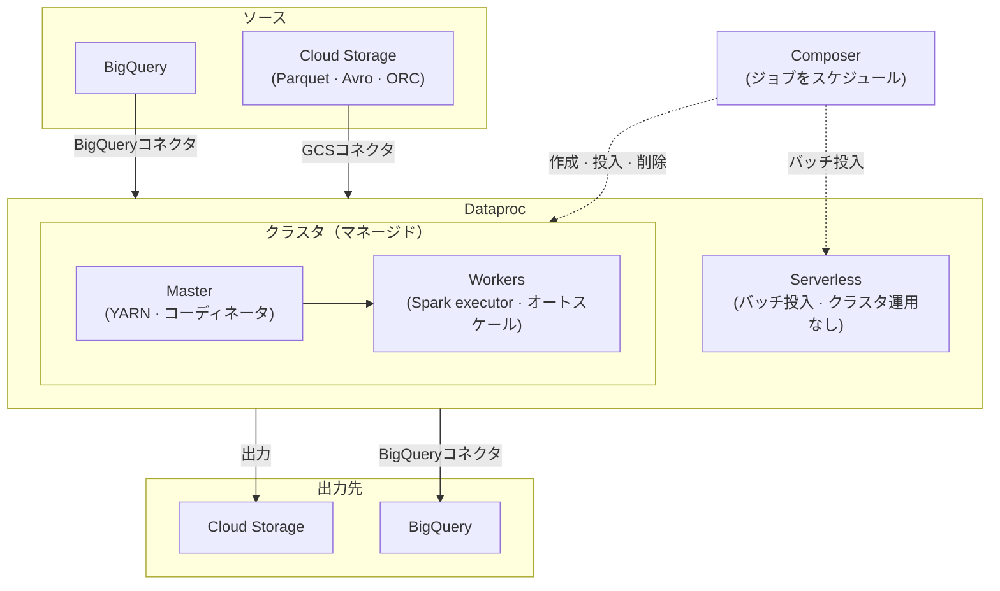

# Dataproc

Dataproc は、Apache Spark、Hadoop などのビッグデータ関連ツールを実行するためのGCPマネージドサービスである。[[Cloud-Storage|Cloud Storage]] と [[Storage/BigQuery|BigQuery]] と統合され、高速なクラスタプロビジョニングにより、フルスタックを自前運用せずに分散バッチ処理を実行できる。

## ユースケース
- Spark（PySpark/Scala）による大規模バッチETL/ELT。
- まだ稼働が必要なレガシーHadoopエコシステム（Hive、Pig）ワークロード。
- [[Processing/Dataflow|Dataflow]] に乗りにくいアドホック探索や一回限りのバックフィル。
- 大規模データセット上でのSparkによるML特徴量エンジニアリング。

## メンタルモデル
- クラスタ（ノード、オートスケール）は管理するが、下位インフラは運用しない。
- ストレージは分離される：永続データはクラスタディスクではなく、[[Cloud-Storage|Cloud Storage]] や [[Storage/BigQuery|BigQuery]] に置く。
- ジョブをクラスタへ投入する。クラスタは一時（ephemeral）にも長期稼働にもできる。
- 性能はデータローカリティ、shuffle量、クラスタサイジングに依存する。

## コア概念

| 概念 | 説明 |
| --- | --- |
| **クラスタ** | Spark/Hadoopサービスを実行するVMの集合 |
| **Master/Worker** | Masterがジョブを調整し、Workerがタスクを実行する |
| **ジョブ** | 提出されたSpark/Hadoopワークロード |
| **オートスケーリング** | YARNメトリクスに基づいてWorker数を調整する |
| **初期化アクション** | クラスタ作成時に実行されるカスタマイズ用スクリプト |
| **Workflow templates** | パラメータと依存関係を持つ複数ジョブのパイプライン定義 |
| **クラスタプロパティ** | `--properties` フラグで作成時にSpark/Hadoop/Dataprocの設定を指定する |

**クラスタプロパティ例** — スケジューラレベルで同時実行ジョブ数を制限する:
```bash
gcloud dataproc clusters create my-cluster \
  --properties=dataproc:dataproc.scheduler.max-concurrent-jobs=5
```

## ジョブ実行アーキテクチャ



## クラスタ種別

| 種別 | 使う場面 |
| --- | --- |
| **Single-node** | 開発/テスト、軽量ジョブ |
| **Standard** | 本番バッチワークロード（master + workers） |
| **Ephemeral** | create → 実行 → delete。断続的ワークロードで最小コスト |

## ジョブ種別

| 種別                  | 補足                                            |
| --------------------- | ----------------------------------------------- |
| Spark（PySpark/Scala） | データエンジニアリングで最も一般的               |
| Hadoop MapReduce      | レガシー処理                                     |
| Hive                  | Hadoopデータセット上のSQL（GCPでは現在は少なめ） |
| Presto/Trino          | カスタムセットアップによるアドホックSQL          |

## ストレージとデータアクセス
- [[Cloud-Storage|Cloud Storage]] は、GCSコネクタ経由でSpark/Hadoopのデフォルトデータレイクになる。
- [[Storage/BigQuery|BigQuery]] コネクタにより、Sparkがテーブルを直接読み書きできる。
- ジョブのライフサイクルを超えてローカルディスクにデータを置かない（クラスタとともに消える）。
- I/O負荷が高い場合、spill/shuffle性能改善のために小さな永続ディスクを追加する。

## Dataproc Metastore

Dataproc Metastore は、GCPのフルマネージド Apache Hive Metastore（HMS）サービスである。テーブルスキーマ、パーティション位置、ストレージパスを保存する中央メタデータリポジトリとして機能し、クラスタのライフサイクルから独立して永続化する。

- **重要な理由:** 一時クラスタは削除で組み込みmetastoreを失う。Dataproc Metastore はクラスタ再作成後も残り、複数クラスタで共有できる。
- **使う場面:** 複数のDataprocクラスタでテーブル定義を共有したい、または一時クラスタのライフサイクルをまたいでメタデータを保持したい場合。
- Dataproc上で動くSpark SQL、Hive、Presto/Trinoジョブと統合される。
- [[Governance/Dataplex|Dataplex]] は、データレイク全体の統一ガバナンス向けに技術メタデータカタログとして使える。

## Hadoop Modernization
on-prem Hadoop を、オーケストレーション変更を最小にしてGCPへ移行する場合:
- Spark/Hadoop互換を保ち、コード変更を最小化するためにワークロードをDataprocへ移す。
- GCSコネクタ経由でHDFSを [[Cloud-Storage|Cloud-Storage]] に置き換える（NameNodeとレプリケーションのオーバーヘッドを排除）。
- 既存Airflow DAGは [[Cloud-Composer|Cloud-Composer]] へ移して維持する。
- Dataflow/Beam や Data Fusion への書き換えは「最小変更」ではなく、より大きい再設計になる。

## 性能とコスト
- Workerを適正サイジングする：Sparkのワークロード種別によってCPU/メモリプロファイルが重要。
- 変動ワークロードにはオートスケーリングを使い、妥当なmin/max境界を設定する。
- shuffleが重いジョブが時間とコストの大半を支配するため、結合とパーティショニングを最適化する。
- 述語プッシュダウンが効くカラムナ形式（Parquet/ORC）を優先する。
- コスト削減には preemptible/spot worker を使う（中断に備えたリトライロジックが必要）。

## 信頼性と運用
- YARN/Spark UIでデータスキューとexecutor障害を監視する。
- 長期稼働クラスタで設定ドリフトが起きる前提で、クラスタ再作成を計画する。
- 可能なら一時クラスタを使い、設定ドリフト自体を避ける。

## DRパターン（デュアルリージョンGCS + Turbo Replication）
- デュアルリージョンバケットの Turbo Replication は、オブジェクトに対して約15分のRPOを提供する。
- Dataprocクラスタは、アクティブなGCSレプリカと同じリージョンで動かす。
- リージョン障害時：もう一方のリージョンでクラスタを再デプロイする（データは同一バケット内ですでに複製済み）。
- マルチリージョンバケットと「1時間ごとの転送スケジュール」では、15分RPOは **保証されない**。

## セキュリティとガバナンス
- ジョブ実行には、最小権限の [[Security/IAM|IAM]] を持つサービスアカウントを使う。
- 保存時暗号化でCMEKが必要なら有効化する。
- クラスタは [[Cloud-Storage|Cloud-Storage]] と [[Storage/BigQuery|BigQuery]] のデータと同じリージョンに置く。
- ハードウェア分離/コンプライアンス要件では、Dataprocを **sole‑tenant nodes** 上で実行する（standard/Confidential VMでは専有物理ホストが保証されない）。

## よくある落とし穴
- 小規模/断続的ジョブに対してクラスタを過剰プロビジョニングする — アイドルWorkerがコストを生む。一時クラスタ（create → run → delete）や Dataproc Serverless を使う。
- 重要データをローカルHDFSに置く — クラスタ削除で消える。出力は必ず [[Cloud-Storage|Cloud Storage]] または [[Storage/BigQuery|BigQuery]] に書く。
- ホットパーティションでスキューしステージが遅くなる — 1つのexecutorがホットキーを処理し、他がアイドルになる。集計前にrepartitionするか、キーをソルト化する。
- 広い結合や不適切なパーティショニングでshuffleが巨大化する — 実行時間とコストの大半を支配する。早めにフィルタし、カラムナ形式を使い、小さなテーブルはbroadcastして結合する。
- shuffleが重いステージでオートスケーリングする — shuffle中にWorkerが外れてタスク失敗/リトライが増える。shuffle集約ジョブではオートスケールを無効化するか、Dataflowへ切り替える。
- クラスタと [[Cloud-Storage|Cloud Storage]] のリージョン不一致 — クロスリージョンのエグレスコストとレイテンシ増を招く。クラスタとデータバケットは必ず同居させる。
- 長期稼働クラスタで設定ドリフトが蓄積する — 手動適用したパッケージやinit actionsが時間とともに乖離する。再現性のために一時クラスタやカスタムイメージを優先する。

## 連携
- [[Cloud-Storage|Cloud-Storage]]：入出力の主要ストレージ層。
- [[Storage/BigQuery|BigQuery]]：コネクタ経由の分析ウェアハウスのソース/シンク。
- [[Cloud-Composer|Cloud-Composer]]：Airflow operatorで複数ステップのDataprocジョブをオーケストレーションする。
- [[Processing/Dataflow|Dataflow]]：クラスタ運用なしのマネージドパイプライン代替。

## クイックチェックリスト
- クラスタ種別を選ぶ：断続的ジョブは一時（create → run → delete）、継続ワークロードは長期稼働。
- クラスタリージョンを [[Cloud-Storage|Cloud Storage]] と [[Storage/BigQuery|BigQuery]] のデータに揃える。
- 永続データはすべて [[Cloud-Storage|Cloud Storage]] に保存する（ローカルHDFSに依存しない。クラスタ削除で消える）。
- shuffle量を抑えるため、カラムナ形式（Parquet/ORC）とパーティショニングを使う。
- オートスケーリングのmin/max境界を設定し、YARN/Spark UIでスキューとexecutor障害を監視する。
- コスト削減には preemptible/spot worker を使い、中断に耐えるリトライを用意する。
- 複数クラスタでスキーマメタデータを共有する/クラスタ削除後もメタデータを残すなら Dataproc Metastore を使う。
- ジョブ実行用サービスアカウントは最小権限IAMで構成し、必要ならCMEKを有効化する。
