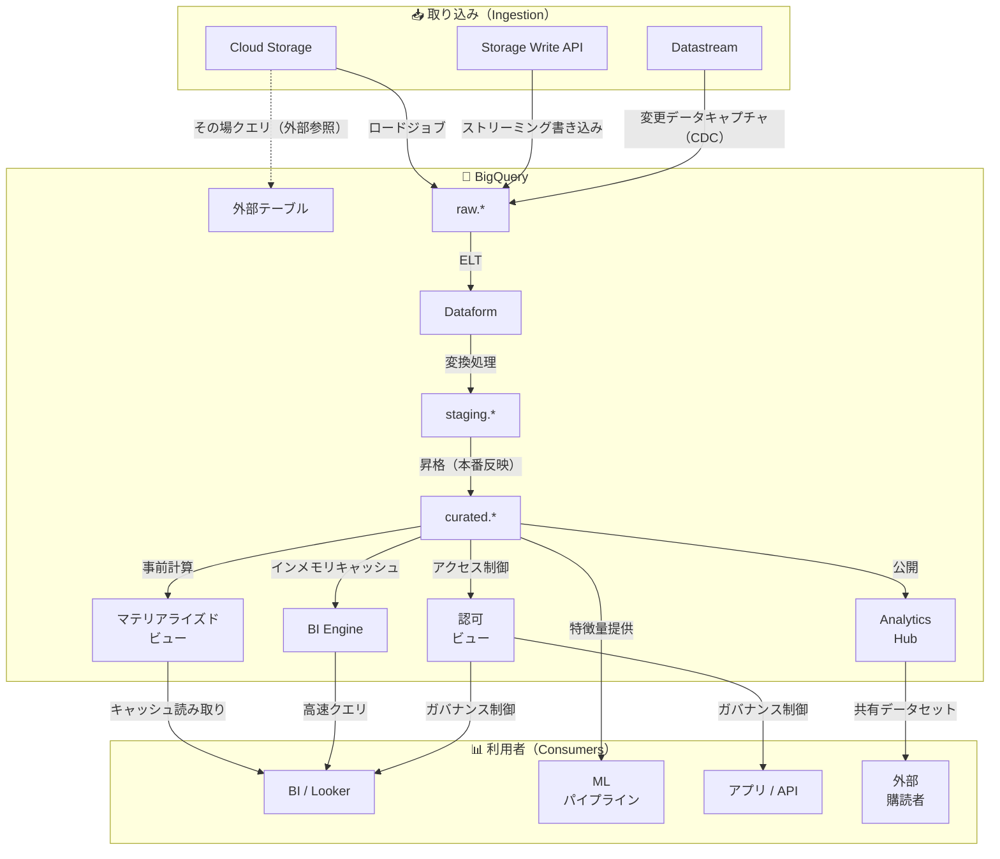

# BigQuery

BigQuery は、GCPのフルマネージドなサーバレスデータウェアハウスである。カラムナストレージ、スケールするSQL、コンピュートとストレージの分離が特徴。

## ユースケース
- ダッシュボード、レポーティング、アドホック分析のための中央分析ウェアハウス。
- ELTのターゲット：データを着地（多くは [[Cloud-Storage|Cloud Storage]] 経由）させ、SQLで変換する。
- 下流コンシューマ（BI、データサイエンス、ML特徴量）向けのキュレート済みサービング層。
- ガバナンスときめ細かなアクセス制御を伴う、大規模データセットの高速な探索。

## メンタルモデル
- ストレージとコンピュートは分離される：データはテーブルに保存され、クエリは共有コンピュートを使うジョブとして実行される。
- ロケーションが重要：エグレスの想定外コストを避けるため、[[Cloud-Storage|GCS]]/[[Processing/Dataflow|Dataflow]]/[[Processing/Dataproc|Dataproc]] はデータセットと同じリージョン/デュアルリージョンに揃える。
- すべてがジョブ：クエリ、ロード、エクスポート、コピーは監査可能なジョブ記録を残す。

## 主要リソース

| リソース           | 説明                                                       |
| ----------------- | ---------------------------------------------------------- |
| プロジェクト        | 課金 + IAMの境界                                           |
| データセット        | テーブル/ビューのコンテナ（ロケーション + アクセスポリシーを持つ） |
| テーブル            | ネイティブ（マネージド）または外部（GCSファイルへのポインタ）      |
| ビュー              | 保存クエリ（抽象化とアクセス制御に有用）                    |
| マテリアライズドビュー | 事前計算結果（増分で自動更新）                              |
| ルーチン            | UDFとストアドプロシージャ                                   |
| ジョブ              | query/load/extract/copy の作業単位                          |
|                   |                                                            |

## ストレージとテーブル種別

**ネイティブテーブル** — BigQuery管理のカラムナストレージにデータを保持する。ウェアハウス用途で性能とガバナンスが最適。

**外部テーブル** — [[Cloud-Storage|GCS]] 上のファイル（Parquet/Avro/CSV/JSON/ORC）をロードせずにクエリする。性能/コストのトレードオフはあるが、探索やステージングに有用。
- `.xlsx` は **未サポート** — 先にCSVへ変換する。
- 外部テーブルはGCSのみ対応。S3はBigQuery Omniが必要。BigLakeテーブルは、バケットへの直接権限なしでテーブル単位のアクセスを提供する。
- **外部テーブルの性能:** GCS上の外部テーブルで小さいファイルが数百万ある場合、**BigLake** に変換し **metadata caching** を有効化して、ファイル/メタデータのオーバーヘッドを下げ、クエリレイテンシを改善する。通常の外部テーブルは遅いままになりやすい。

**半構造** — ネスト/繰り返しフィールド（`STRUCT`, `ARRAY`）はファーストクラス。JSON型もあるが、強い型付けの列の方が最適化とガバナンスが容易。

**データ管理:**
- 一時/ステージング用データセットではテーブル有効期限を設定する。
- Time Travel：保持期間内の過去バージョンをクエリできる（「やらかし」復旧）。
- スナップショット/クローン：デバッグや制御された再処理のためのポイントインタイムコピー。
- 復旧ルール：7日以内は Time Travel、7日超または固定の復旧ポイントが必要 → テーブルスナップショットまたはGCSエクスポート。
- 影響範囲（blast radius）を抑えるために、時間パーティション（または月次テーブル）を使う。
- 履歴分析やSCD風のパターンでは、取り込み/有効時刻を持つ **非正規化の追記専用（append-only）** テーブルを優先する（スナップショットのオーバーヘッドなしで履歴をクエリ可能にし、BIにも扱いやすい）。

**スキーマ進化:**
- 追加は `NULLABLE` 列のみ、または `REQUIRED` の緩和のみ。
- リネームと型変更は新規テーブル + バックフィルが必要（リネーム/型変更の `ALTER COLUMN` はサポートされない）。

## マテリアライズドビュー
- 繰り返し実行する分析クエリ向けに、集計結果を事前計算して保存する。
- ベーステーブルの変更に基づき自動更新する（通常は増分）。
- 対応するクエリパターンでは、スキャン量削減とレイテンシ改善ができる。
- BigQueryクエリに **OUTER JOIN** や **ウィンドウ関数** が含まれる場合、増分マテリアライズドビューは非対応。**非増分マテリアライズドビュー**（`allow_non_incremental_definition = TRUE`）を使い、`max_staleness`（例：8時間）を設定して、鮮度要件を満たしつつダッシュボードを高速化する。

## パーティショニングとクラスタリング（性能 + コスト）

パーティショニングは、不要なパーティションをプルーニングしてスキャンバイトを削減する。

| 種別            | 使う場面                                             |
| --------------- | -------------------------------------------------- |
| 時間単位         | クエリがDATE/TIMESTAMPで継続的にフィルタする（最も一般的） |
| 取り込み時刻      | すぐ始められるが、制御が明示的でない                  |
| 整数レンジ        | 数値レンジでパーティション分割する                   |

クラスタリングは、パーティション内を最大4列でソートし、フィルタ/結合のプルーニングを改善する。

**経験則:**
- クエリが時間でフィルタするなら時間パーティション、頻繁にフィルタ/結合する列（多くはID）でクラスタリングする。
- 大規模テーブルでは、意図しないフルスキャン防止のため `require partition filter` を検討する。
- 実際のクエリパターンでクラスタリング効果を検証する（思い込みで決めない）。
- 時系列テーブルで保持/レポートが業務時刻に基づくなら、取り込み時刻よりイベント時刻（例：`measurement_date`）でパーティション分割する。

| 選択肢 | 最適 | 勝つ/負ける理由 |
| --- | --- | --- |
| `measurement_date` の時間単位パーティション | イベント/計測時刻に基づく分析と保持 | 直近の「計測された」期間（例：直近120計測日）だけを正確に保持できる。 |
| 取り込み時刻パーティション | イベント時刻が欠損/信頼できない場合の高速なraw着地 | 直近の取り込み日数を保持してしまい、直近の計測日数を保持できないため、業務時刻ベースの保持要件に失敗する。 |

- パーティションテーブルにパーティション有効期限（例：`120` days）を設定し、古いパーティションを自動削除してストレージコストを制御する。
- **よくある罠:** 問いが「実際の計測時刻での保持」を求めているのに、取り込み時刻パーティションを選ぶ。

## 取り込み（データが入る経路）

**バッチ（バルクロード推奨）:**
- [[Cloud-Storage|GCS]] からロードジョブ（分析にはParquet/Avro推奨）。
- 明示的なスキーマと安定したファイル命名で、再実行/バックフィルを予測可能にする。

**ストリーミング:**
- Storage Write API：現代的な選択肢（より高スループットで扱いやすい）。
- Legacy streaming inserts：新規設計では最終手段。
- **CDC (Change Data Capture)**：行レベルの INSERT/UPDATE/DELETE イベントをストリーミングし、フルリロードなしでBigQueryと同期させる。

**BigQuery内ELT:**
- 初回構築は `CREATE TABLE AS SELECT`。
- 増分アップサートは `MERGE`。
- パーティション/日単位で安全に作り直せる場合はパーティション上書き。
- CDCでは、レポーティングに対して **追記専用ステージング + 定期MERGE** を使う（OLTP風の行単位 UPDATE/DELETE は避ける）。

## 変換パターン（Raw → Curated）



増分アップサート:
```sql
MERGE `curated.orders` T
USING `staging.orders_delta` S
ON T.order_id = S.order_id
WHEN MATCHED THEN
  UPDATE SET amount = S.amount, updated_at = S.updated_at
WHEN NOT MATCHED THEN
  INSERT (order_id, amount, updated_at) VALUES (S.order_id, S.amount, S.updated_at);
```

## クエリ機能
- Standard SQL：ウィンドウ関数、CTE、分析関数、arrays/structs。
- Scripting：変数と制御フローを含むマルチステートメントSQL。
- UDF：SQL UDFを優先し、JavaScript UDFは必要最小限にする（ガバナンス/デバッグの運用負荷）。
- ストアドプロシージャ：カプセル化に有用。ただしパイプラインの可観測性（行数、失敗、入力範囲のログ）を維持する。

## 性能とコスト

**コスト要因:** ストレージ（アクティブ vs 長期） · スキャンバイト（オンデマンド） · スロット（キャパシティ） · ストリーミング取り込み。

**日々の調整ポイント:**
- 必要な列だけを選ぶ（本番クエリでの `SELECT *` を避ける）。
- パーティション列でフィルタし、プルーニングを効かせる。
- サポートされるパターンに合う繰り返し集計はマテリアライズドビューを優先する。
- 厳密性が不要なら `APPROX_*` 関数を使う。

**キャパシティ vs オンデマンド:**
- オンデマンド：最も簡単。スキャンバイト課金。
- キャパシティ（スロット）：大規模では予測可能。予約/割り当てでprod/devを分離し、SLAを守る。
- 予約はデータセットや個別ジョブではなく **assignments（org/folder/project）** で紐づく。分離にはプロジェクトスコープが一般的。

**クエリ優先度:**

| 優先度 | レイテンシ | 最適 | 避ける場面 |
| --- | --- | --- | --- |
| Interactive（default） | すぐ開始する | ユーザー向け分析、アドホック、低レイテンシ要件 | 待てるワークロード |
| Batch | キュー待ち（最大24h） | 緊急でないETL/バックフィル | ダッシュボード/SLAが厳しいワークロード |

- on-demand課金では、InteractiveとBatchのどちらも処理バイトで課金される。
- 緊急でないジョブには `bq query --batch 'SELECT ...'` を使う。
- **よくある罠:** 要件が「即時に結果が必要」なのにBatch優先度を選ぶ。
- on-demandのクエリ費用は `estimated_cost ~= (bytes_processed / 1 TB) * price_per_TB` で概算できる。
- 実行前にdry runでスキャンバイトを見積もる：
```bash
bq query --use_legacy_sql=false --dry_run 'SELECT ...'
```

## セキュリティ、ガバナンス、共有

**IAM:** アクセス付与はデータセット単位で行う。個人ユーザーではなく、グループ/サービスアカウントを使う。

**きめ細かなアクセス制御:**

| 要件 | 使う | 避ける | 理由 |
|---|---|---|---|
| ユーザー/グループごとに特定列（例：PII）を隠す | CLS（policy tags） | Dataset IAM only | IAMは粗すぎる。CLSはポリシータグ権限で強制される |
| ベーステーブルへのアクセスなしで安全な列サブセットだけ共有する | Authorized views | CLS alone | ベーステーブルアクセスを拒否する必要がある場合、試験ではAuthorized viewsが基本解 |
| ユーザーごとに見える行が異なる | RLS | CLS | CLSは列を隠すが、行は隠さない |

- 広いコンシューマ向け分析では、上流で [[Security/DLP|DLP]] により匿名化（de-identified）したデータセットを優先する。
- 組織横断共有では、[[Processing/Dataflow|Dataflow]] + [[Security/DLP|DLP]] でマスキング/トークン化した版を公開する（暗号化ストレージだけでは不十分）。

**CLS:**
- ポリシータグは、タクソノミーで **policy tag access control** を有効化している場合にのみ強制される（そうでなければラベルのように振る舞う）。
- `roles/bigquery.dataViewer` を外すだけでは不十分なことがある。ポリシータグに対して `roles/datacatalog.categoryFineGrainedReader` を持っていれば見える。

**Analytics Hub** — データを複製せずにチーム横断でデータセットを公開する。コンシューマは自分のプロジェクトからサブスクライブし、運用負荷を抑えつつ中央ガバナンスを効かせられる。
- 外部組織がCloud KMS鍵にアクセスできない場合、CMEK保護テーブルを直接共有しない。Analytics Hubで、非CMEKデータセットに匿名化コピーを公開する。
- ユーザー単位の暗号削除（crypto-deletion）には **BigQueryの列レベルAEAD + ユーザー単位のKMS鍵** が必要（鍵破棄＝アクセス削除）。**CMEK** はテーブル/データセット全体の暗号化であり、単一ユーザーだけを削除できない。
- Exchange = 発見のためのカタログ（ストレージではない）。組織間共有はAnalytics Hubのlistingで行う。

**暗号化:** 既定は保存時暗号化。顧客管理鍵は [[Cloud-KMS]] 経由のCMEKを使う。

**監査:** Cloud Audit Logsは **誰が何にアクセスしたか**（管理 + データアクセス）を答えるが、スロット/キューのボトルネックは分からない。クエリ単位の指標（処理バイト、slot time、queue time、ユーザー）は `INFORMATION_SCHEMA.JOBS*` を使う。システム全体のスロット飽和は Admin Resource ダッシュボードと組み合わせる。

## 連携
- [[Cloud-Storage]]：バッチロード/エクスポート、外部テーブル。
- [[Processing/Dataflow|Dataflow]]：BigQueryとの入出力を行うストリーミング/バッチパイプライン。
- [[Processing/Dataproc|Dataproc]]/Spark：コネクタ経由の読み書き（多くは [[Cloud-Storage|GCS]] をステージングに使う）。
- Looker/BI：キュレート済みテーブル上のセマンティックモデルとダッシュボード。
- 完全な履歴はBigQueryに置き、低レイテンシの「最新状態」はサービングDB（Cloud SQL/Bigtable/Firestore）に置く。API呼び出しのたびに履歴をスキャンしないよう、ストリーム/ETLで `latest_state` テーブルを構築する。

## クイックチェックリスト
- データセットのロケーションを決める（リージョン戦略に揃える）。
- 命名規約（`raw`, `staging`, `curated`）とオーナーラベルを定義する。
- 実際のクエリパターンに基づき、大規模テーブルをパーティション/クラスタ化する（パーティションフィルタ必須化も検討）。
- 取り込み方式（load vs streaming）を選び、パイプラインを冪等にする。
- 最小権限IAMを設定し、機微データにはRLS/CLSを追加する。
- コストのガードレール（budgets/quotas）を追加し、`INFORMATION_SCHEMA` で高額クエリを監視する。
