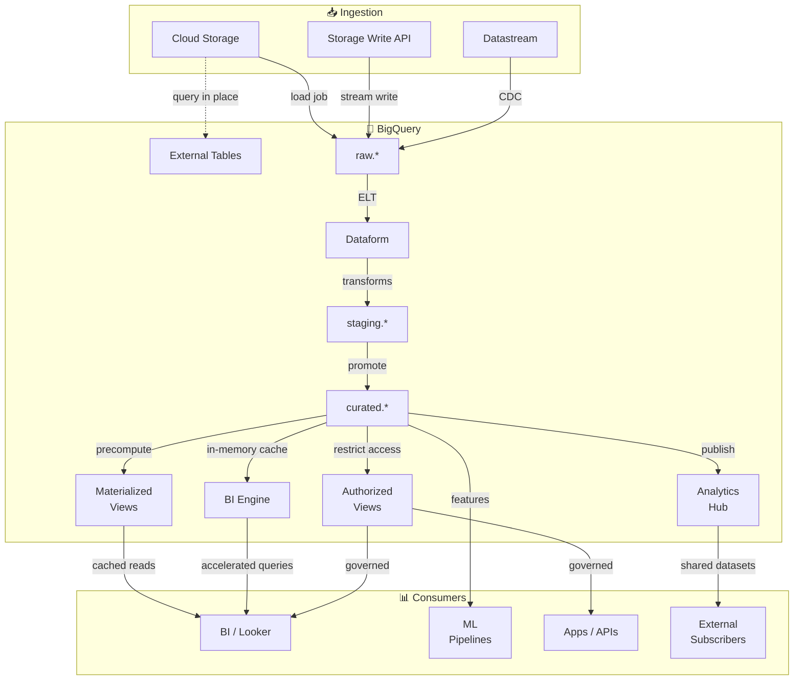

# BigQuery

BigQuery is GCP's fully managed, serverless data warehouse — columnar storage, SQL at scale, separated compute and storage.

## Use Cases
- Central analytics warehouse for dashboards, reporting, and ad-hoc analysis.
- ELT target: land data (often via [[Cloud-Storage|Cloud Storage]]) and transform with SQL.
- Curated serving layer for downstream consumers (BI, data science, ML features).
- Fast exploration over large datasets with governance and fine-grained access controls.

## Mental Model
- Storage and compute are separated: data lives in tables; queries run as jobs using shared compute.
- Location matters: keep [[Cloud-Storage|GCS]]/[[Processing/Dataflow|Dataflow]]/[[Processing/Dataproc|Dataproc]] in the same region/dual-region as your dataset to avoid egress surprises.
- Everything is a job: queries, loads, extracts, and copies create auditable job records.

## Core Resources

| Resource          | Description                                                |
| ----------------- | ---------------------------------------------------------- |
| Project           | Billing + IAM boundary                                     |
| Dataset           | Container for tables/views; has a location + access policy |
| Table             | Native (managed) or external (pointer to GCS files)        |
| View              | Saved query; useful for abstraction and access control     |
| Materialized view | Precomputed results; auto-refreshes incrementally          |
| Routines          | UDFs and stored procedures                                 |
| Jobs              | Query/load/extract/copy work units                         |
|                   |                                                            |

## Storage And Table Types

**Native tables** — data in BigQuery-managed columnar storage; best performance and governance for warehousing.

**External tables** — query files in [[Cloud-Storage|GCS]] (Parquet/Avro/CSV/JSON/ORC) without loading; good for exploration and staging with performance/cost tradeoffs.
- `.xlsx` is **not supported** — convert to CSV first.
- External tables are GCS-only; S3 requires BigQuery Omni, and BigLake tables provide table-level access without direct bucket permissions.
- **External Performance:** For external tables on GCS with millions of small files, convert to **BigLake** and enable **metadata caching** to reduce file/metadata overhead and improve query latency; plain external tables stay slow. 

**Semi-structured** — nested/repeated fields (`STRUCT`, `ARRAY`) are first-class; JSON type exists but strongly typed columns are easier to optimize and govern.

**Data management:**
- Table expiration for transient/staging datasets.
- Time travel: query prior versions within the retention window ("oops" recovery).
- Snapshots/clones for point-in-time copies for debugging or controlled reprocessing.
- Recovery rule: Time Travel within 7 days; beyond 7 days or fixed restore points → table snapshots or GCS export.
- Partition by time (or monthly tables) to limit blast radius.
- For history analytics and SCD-like patterns, prefer a **denormalized, append-only** table with ingestion/effective timestamps — keeps history queryable and BI-friendly without snapshot overhead.

**Schema evolution:**
- Only add `NULLABLE` columns or relax `REQUIRED`.
- Renames and type changes require a new table + backfill — `ALTER COLUMN` for rename or retype is not supported.

## Materialized Views
- Precompute and store aggregated results for repeated analytical queries.
- Auto-refresh based on base table changes, typically incrementally.
- Reduce scanned data and improve latency for compatible query patterns.
- If a BigQuery query contains **OUTER JOINs or window functions**, incremental materialized views are unsupported. Use a **non-incremental materialized view** (`allow_non_incremental_definition = TRUE`) and set `max_staleness` (e.g., 8 hours) so refresh-time computation keeps dashboards fast while meeting data freshness requirements.

## Partitioning And Clustering (Performance + Cost)

Partitioning reduces scanned bytes by pruning irrelevant partitions.

| Type            | When To Use                                        |
| --------------- | -------------------------------------------------- |
| Time-unit       | Queries routinely filter by DATE/TIMESTAMP (most common) |
| Ingestion-time  | Quick to start; less explicit control              |
| Integer range   | Partition by a numeric range                       |

Clustering sorts data within partitions by up to 4 columns for better filter/join pruning.

**Rules of thumb:**
- Partition by time when queries filter by time; cluster by frequently filtered/joined columns (often IDs).
- Consider `require partition filter` on large tables to prevent accidental full scans.
- Verify clustering impact with real query patterns — don't assume.
- For time-series tables, prefer partitioning on event time (for example, `measurement_date`) over ingestion time when retention/reporting is based on business time.

| Option | Best For | Why It Wins / Fails |
| --- | --- | --- |
| Time-unit partitioning on `measurement_date` | Analytics and retention based on event/measurement time | Keeps exactly the most recent measured data window (for example, last 120 measured days). |
| Ingestion-time partitioning | Fast raw landing when event time is missing/unreliable | Fails business-time retention needs because it keeps last ingest days, not last measured days. |

- Set partition expiration on the partitioned table (for example, `120` days) to auto-delete old partitions and control storage cost.
- **Common trap:** choosing ingestion-time partitioning for domain-time analytics when the question asks for actual measured-time retention.

## Ingestion (How Data Gets In)

**Batch (preferred for bulk loads):**
- Load jobs from [[Cloud-Storage|GCS]] (Parquet/Avro recommended for analytics).
- Use explicit schemas and stable file naming for predictable reruns/backfills.

**Streaming:**
- Storage Write API: modern option; higher throughput and better ergonomics.
- Legacy streaming inserts: last resort for new designs.
- **CDC (Change Data Capture)**: streams row‑level INSERT/UPDATE/DELETE events to keep BigQuery in sync without full reloads.

**ELT inside BigQuery:**
- `CREATE TABLE AS SELECT` for initial builds.
- `MERGE` for incremental upserts.
- Partition overwrites when a full partition/day can be safely rebuilt.
- For CDC, use **append‑only staging + scheduled MERGE** into reporting; avoid per‑row UPDATE/DELETE (OLTP‑style).

## Transform Patterns (Raw → Curated)



Incremental upsert:
```sql
MERGE `curated.orders` T
USING `staging.orders_delta` S
ON T.order_id = S.order_id
WHEN MATCHED THEN
  UPDATE SET amount = S.amount, updated_at = S.updated_at
WHEN NOT MATCHED THEN
  INSERT (order_id, amount, updated_at) VALUES (S.order_id, S.amount, S.updated_at);
```

## Querying Features
- Standard SQL: window functions, CTEs, analytic functions, arrays/structs.
- Scripting: multi-statement SQL with variables and control flow.
- UDFs: prefer SQL UDFs; use JavaScript UDFs sparingly (governance/debugging overhead).
- Stored procedures: useful for encapsulation; keep pipelines observable (log row counts, failures, input ranges).

## Performance And Cost

**Cost drivers:** storage (active vs long-term) · bytes scanned (on-demand) · slots (capacity) · streaming ingestion.

**Day-to-day levers:**
- Select only needed columns; avoid `SELECT *` in production queries.
- Filter on partition columns so pruning can happen.
- Prefer materialized views for repeated aggregations that match supported patterns.
- Use `APPROX_*` functions when exact answers aren't required.

**Capacity vs on-demand:**
- On-demand: simplest; pay per bytes scanned.
- Capacity/slots: predictable at scale; use reservations/assignments to separate prod/dev and protect SLAs.
- Reservations attach via **assignments (org/folder/project)**, not datasets or individual jobs; project scope is typical for isolation.

**Query priority:**

| Priority | Latency | Best For | Avoid When |
| --- | --- | --- | --- |
| Interactive (default) | Starts quickly | User-facing analytics, ad-hoc, low-latency needs | Workload can wait |
| Batch | Queued (can wait up to 24h) | Non-urgent ETL/backfills | Dashboard/SLA-sensitive workloads |

- In on-demand pricing, both interactive and batch queries are still charged by bytes processed.
- Use `bq query --batch 'SELECT ...'` for non-urgent jobs.
- **Common trap:** choosing batch priority when the requirement is immediate query results.
- Estimate on-demand query cost with: `estimated_cost ~= (bytes_processed / 1 TB) * price_per_TB`.
- Use dry run to estimate scanned bytes before execution:
```bash
bq query --use_legacy_sql=false --dry_run 'SELECT ...'
```

## Security, Governance, And Sharing

**IAM:** grant access at dataset level; use groups/service accounts, not individual users.

**Fine-grained access:**

| Need | Use | Avoid | Why |
|---|---|---|---|
| Hide specific columns (e.g. PII) by user/group | CLS (policy tags) | Dataset IAM only | IAM is too coarse; CLS enforced via policy tag permissions |
| Share a safe column subset without base table access | Authorized views | CLS alone | Authorized views are the exam-default when base table access must be denied |
| Different users see different rows | RLS | CLS | CLS hides columns, not rows |

- For broad consumer analytics, prefer de-identified datasets created with [[Security/DLP|DLP]] upstream.
- For org-wide sharing, publish a masked/tokenized version via [[Processing/Dataflow|Dataflow]] + [[Security/DLP|DLP]] — not just encrypted storage.

**CLS:**
- Policy tags enforce only when **policy tag access control** is enabled on the taxonomy — otherwise they behave like labels.
- Removing `roles/bigquery.dataViewer` alone doesn't help if users still have `roles/datacatalog.categoryFineGrainedReader` on the policy tag.

**Analytics Hub** — publish datasets cross-team without duplicating data; consumers subscribe from their own projects; central governance with low operational overhead.
- If the external org does not have Cloud KMS key access, do not share CMEK-protected tables directly; publish a de-identified copy in a non-CMEK dataset via Analytics Hub.
- Per-user crypto-deletion needs **column-level AEAD in BigQuery + per-user KMS keys** (destroy key = delete access); **CMEK** only encrypts the whole table/dataset, so it can’t delete a single user.
- Exchange = catalog for discovery (not storage); use Analytics Hub for cross‑org sharing via listings

**Encryption:** default at rest; CMEK via [[Cloud-KMS]] for customer-managed keys.

**Auditing:** Cloud Audit Logs answer **who accessed what** (admin + data access) but do **not** show slot/queue bottlenecks; use `INFORMATION_SCHEMA.JOBS*` for per‑query metrics (bytes processed, slot time, queue time, user). Pair with the Admin Resource dashboard for system‑wide slot saturation.

## Integrations
- [[Cloud-Storage]]: batch loads/extracts; external tables.
- [[Processing/Dataflow|Dataflow]]: streaming/batch pipelines to/from BigQuery.
- [[Processing/Dataproc|Dataproc]]/Spark: read/write via connectors; often staged through [[Cloud-Storage|GCS]].
- Looker/BI: semantic models and dashboards on curated tables.
- Use BigQuery for full history and a serving DB (Cloud SQL/Bigtable/Firestore) for low‑latency “latest state”; build a `latest_state` table via stream/ETL to avoid scanning history for every API call.

## Quick Checklist
- Choose dataset location (align with regional strategy).
- Define naming conventions (`raw`, `staging`, `curated`) and ownership labels.
- Partition/cluster large tables on real query patterns; consider requiring partition filters.
- Choose ingestion method (load vs streaming) and make pipelines idempotent.
- Set least-privilege IAM; add RLS/CLS for sensitive data.
- Add cost guardrails (budgets/quotas) and monitor expensive queries via `INFORMATION_SCHEMA`.
