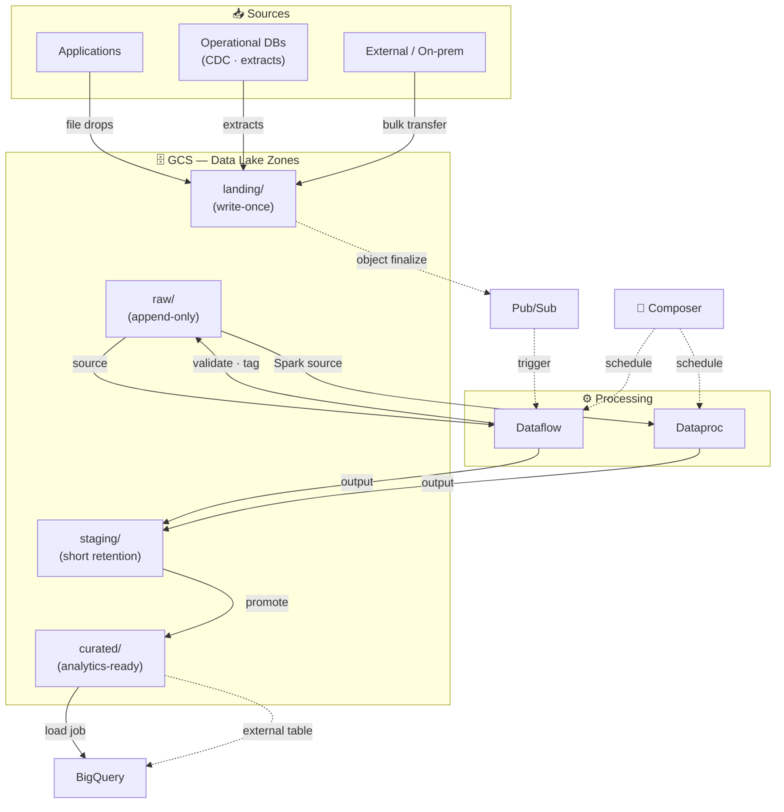

# Cloud Storage (GCS)

Google Cloud Storage is GCP's object storage service — the standard landing zone and data lake layer for analytics pipelines ([[Processing/Dataflow|Dataflow]], [[Processing/Dataproc|Dataproc]], [[Storage/BigQuery|BigQuery]], Vertex AI).

## Use Cases
- Land raw files (extracts, CDC dumps, logs) before loading to [[Storage/BigQuery|BigQuery]].
- Keep immutable, replayable data for backfills, audits, and reprocessing.
- Exchange data between systems using standard formats (Parquet/Avro).
- Store large artifacts (model files, embeddings, feature exports) for downstream jobs.

## Mental Model
- Buckets hold objects; "folders" are prefixes, not real directories.
- No in-place rename — move = copy + delete.
- Strong consistency: reads/lists reflect recent writes immediately (safe for write-then-read pipelines).
- Keep storage + compute in the same region to avoid latency and egress costs.

## Core Concepts
- **Bucket**: top-level container; globally unique name.
- **Object**: bytes + metadata (name, content type, custom fields).
- **Prefix**: pseudo-directory convention (e.g. `raw/dt=2026-02-05/...`).
- **Generation**: object version ID — used with preconditions for safe concurrent writes.

## Locations
| Type | Behaviour |
| --- | --- |
| Region | Single region — lowest latency with co-located compute |
| Dual-region | Two regions — higher availability, recommended for critical data |
| Multi-region | Broad geographic area — being superseded by dual-region for new designs |

## Storage Classes
Storage class affects pricing and retrieval cost, not access speed.

| Class    | Access Pattern    | Notes                                       |
| -------- | ----------------- | ------------------------------------------- |
| Standard | Frequent          | No retrieval cost                           |
| Nearline | ~Monthly          | Retrieval cost; min 30-day storage          |
| Coldline | ~Quarterly        | Higher retrieval cost; min 90-day storage   |
| Archive  | Rarely/Compliance | Highest retrieval cost; min 365-day storage |

Use lifecycle rules to transition or delete objects automatically as they age.

## Data Lake Layout And Formats
Treat naming conventions as partitioning and ownership boundaries.

**Zone layout:**
- `landing/` — immutable source drops (write-once)
- `raw/` — source-aligned, append-only
- `staging/` — intermediate outputs (short retention)
- `curated/` — analytics-ready datasets

**Time-partitioned prefix pattern:**
`raw/source=myapp/dt=2026-02-05/part-0000.parquet`

**Format guidance:**
- Parquet / ORC — columnar; best for analytics and [[Storage/BigQuery|BigQuery]] loads
- Avro — row-based; strong schema evolution; good for streaming
- JSON / CSV — simple but larger and slower; use only when required

## Data Lake Architecture

## Security And Access Control

**Bucket defaults:**
- Enable **Uniform Bucket-Level Access (UBLA)** — disables per-object ACLs; enforces IAM-only access.
- Enable **Public Access Prevention** — blocks accidental public exposure.
- Separate buckets by sensitivity (raw vs curated vs temp) to keep IAM grants simple.

**Common IAM roles:**

| Role                          | Grants                                                                        |
| ----------------------------- | ----------------------------------------------------------------------------- |
| `roles/storage.objectViewer`  | Read and list objects (no writes)                                             |
| `roles/storage.objectCreator` | Write objects only (no read/list)                                             |
| `roles/storage.objectAdmin`   | Read/write/delete objects (no bucket config/IAM)                              |
| `roles/storage.admin`         | Full admin on buckets and objects (IAM, lifecycle, retention) - use sparingly |

**Sharing without broad IAM:**
- Signed URLs — time-limited access to specific objects.

**Encryption:**
- Default: Google-managed encryption (automatic).
- CMEK: use [[Cloud-KMS|Cloud KMS]] for key control, rotation, and audit requirements.
  - CMEK set on a bucket applies to **new writes only** — existing objects must be explicitly rewritten.
  - Compromised key response: create a new key → set as bucket default → copy/rewrite objects (usually into a new bucket).

**Privacy and compliance:**
- Use [[Security/DLP|DLP]] to detect/mask sensitive fields before copying data to analytics buckets.
- Keep restricted raw buckets separate from de-identified datasets.

**Retention and recovery:**
- Object versioning: retains older generations on overwrite/delete — good for recovery, increases cost if unmanaged.
- Retention policy / holds: enforce minimum retention duration (useful for compliance; blocks deletion).

## Pipeline Reliability Patterns
- **Idempotent writes**: use deterministic output names, or write to a temp prefix then promote atomically.
- **Concurrency safety**: use preconditions (generation/metageneration checks) to prevent clobbering concurrent outputs.
- **File sizing**: avoid tiny-file explosions and single oversized files. Target hundreds of MB per file for analytics workloads.

## Lifecycle Rules
- Conditions: `age`, `matchesStorageClass`, `isLive` (versioned buckets).
- **Not supported**: content-based, file extension, or object size filters.
- Common patterns: delete `staging/` objects after N days; transition `raw/` to Coldline after 90 days.
- Watch versioning cost: non-current versions accumulate silently without a lifecycle rule targeting them.

## Moving Data In And Out

| Tool                               | Best For                                                                                                        |
| ---------------------------------- | --------------------------------------------------------------------------------------------------------------- |
| `gcloud storage`                   | Default CLI; recommended going forward                                                                          |
| `gsutil`                           | Legacy CLI; good for initial migration of few very large files; supports `-m` parallelism and resumable uploads |
| **Storage Transfer Service**       | Managed, scheduled transfers — on-prem → GCS, cross-cloud, GCS → GCS                                            |
| **Transfer Appliance**             | Offline migration for multi-PB datasets when WAN is the bottleneck                                              |
| **BigQuery Data Transfer Service** | Managed batch loads from GCS into BigQuery with low ops overhead                                                |

**Storage Transfer Service nuances:**
- For isolated or continuous on-prem ingestion, use the **STS agent** with private connectivity (VPN / Interconnect + Private Google Access).
- For recurring POSIX/NFS sync, the STS agent supports incremental copies (changed files only) with built-in retries, checkpointing, and integrity checks.
- For PB-scale, time-critical transfers, pair **Cloud Interconnect** (dedicated 10/100 Gbps links) with STS (parallel streams, retries, checksum validation, scheduling).

## Integrations
- [[Storage/BigQuery|BigQuery]]: load jobs (batch ingestion); external tables (query in place — good for exploration, slower than native).
- [[Processing/Dataflow|Dataflow]] / [[Processing/Dataproc|Dataproc]]: primary source/sink; naming conventions matter for replay and backfills.
- [[Ingestion/PubSub|Pub/Sub]] notifications: emit events on object finalize to trigger event-based ingestion pipelines.
- [[Processing/Data-Fusion|Data Fusion]]: drag-and-drop UI for batch file ingestion/ETL; not for real-time anomaly detection (use [[Ingestion/PubSub|Pub/Sub]] + [[Processing/Dataflow|Dataflow]] streaming).

## Ops And Cost Controls
- Lifecycle rules are the primary cost lever (class transitions + deletion of temp/staging objects).
- Cloud Audit Logs: captures policy and access changes for compliance.
- Cloud Monitoring / Logging: tracks bucket growth, error rates, and access patterns.

## Quick Checklist
- UBLA enabled; public access prevention enforced.
- Least-privilege IAM — groups/service accounts, buckets separated by sensitivity.
- Naming convention and zone layout documented (including time-partition prefixes).
- Lifecycle rules configured (temp deletion, class transitions, versioned object expiry).
- Versioning and retention decisions made intentionally and monitored for cost.
