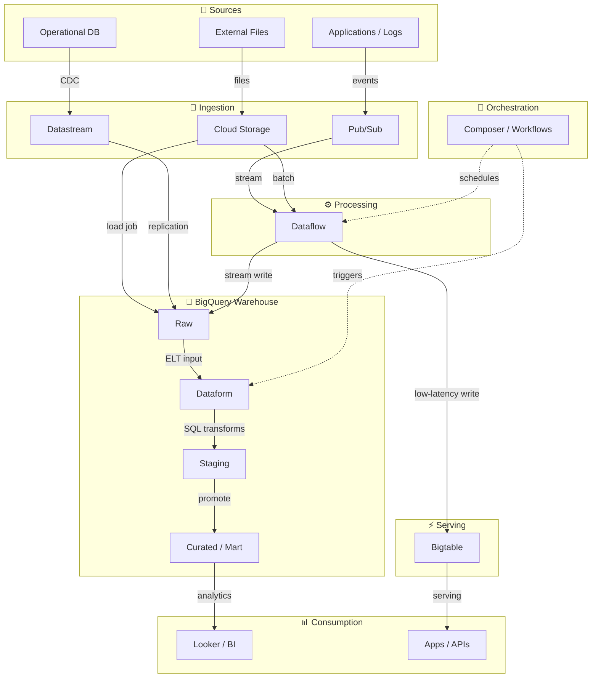

# GCP Data Engineer 

Use this page as an index for what to learn and what to practice. The goal is not memorizing services; it is being able to design, build, operate, and secure data pipelines on GCP.

## Outcomes (What "Good" Looks Like)
- Build batch pipelines (files -> warehouse) and streaming pipelines (events -> warehouse/serving).
- Design for reliability: idempotency, retries, backfills/replays, late data handling.
- Control cost: storage lifecycle, query bytes scanned, right-sizing compute, workload separation.
- Govern access: least-privilege [[Security/IAM|IAM]], sensitive data handling, auditing, and metadata.

## Suggested Study Order
1) Foundations (GCP resource model + data fundamentals)
2) Storage + warehouse ([[Cloud-Storage|GCS]] + [[Storage/BigQuery|BigQuery]])
3) Batch ingestion + ELT (load -> transform -> publish)
4) Streaming ingestion + processing ([[Ingestion/PubSub|Pub/Sub]] -> [[Processing/Dataflow|Dataflow]] -> sinks)
5) Orchestration + operations + governance (make it production-grade)

## Reference Architectures (Mental Models)

## Which Service Do I Pick?

### Storage / Database
- Need **ad-hoc SQL analytics** on large datasets → [[Storage/BigQuery|BigQuery]]
- Need **high-throughput, low-latency key lookups** (time-series, IoT, wide rows) → [[OperationalDBs/Bigtable|Bigtable]]
- Need **relational OLTP**, moderate scale, existing Postgres/MySQL → [[Cloud-SQL|Cloud-SQL]] or [[OperationalDBs/AlloyDB|AlloyDB]] (AlloyDB for higher performance)
- Need **globally distributed relational** with strong consistency → [[OperationalDBs/Spanner|Spanner]]
- Need **document store** for semi-structured, mobile/web, real-time sync → [[OperationalDBs/Firestore|Firestore]]
- Need **in-memory cache** to reduce DB load, session store → [[OperationalDBs/Memorystore|Memorystore]]

### Processing
- Need **streaming OR batch with one API** (Apache Beam), fully managed → [[Processing/Dataflow|Dataflow]]
- Need **Spark/Hadoop ecosystem**, existing Spark jobs, ML on big data → [[Processing/Dataproc|Dataproc]]
- Need **SQL-only transforms inside BigQuery** (ELT, incremental models) → [[Processing/Dataform|Dataform]]

### Ingestion
- Need **real-time event streaming**, decoupled producers/consumers → [[Ingestion/PubSub|Pub/Sub]]
- Need **CDC from an existing OLTP database** (ongoing replication) → [[Ingestion/Datastream|Datastream]]
- Need **bulk file ingestion** from external systems → [[Cloud-Storage|Cloud Storage]] landing + BigQuery load

### Orchestration
- Need **complex multi-step pipelines**, cross-system dependencies, existing Airflow → [[Cloud-Composer|Cloud-Composer]]
- Need **lightweight serverless workflows**, HTTP-based integrations, simple DAGs → [[Orchestration/Workflows|Workflows]]

---

## Study Map By Domain
| Domain             | What To Learn                                                                             | GCP Services / Notes                                                                                  |
| ------------------ | ----------------------------------------------------------------------------------------- | ----------------------------------------------------------------------------------------------------- |
| Foundations        | org/projects, regions, quotas, service accounts; OLTP vs OLAP; schemas; data quality      | [[Security/IAM\|IAM]]                                                                                 |
| Storage            | object naming, locations, lifecycle, access patterns                                      | [[Cloud-Storage\|Cloud Storage]]                                                              |
| Warehousing        | partitioning/clustering, ingestion, views/materialized views, cost model                  | [[Storage/BigQuery\|BigQuery]]                                                                        |
| Ingestion          | delivery semantics, retries/DLQ, CDC basics, file formats                                 | [[Ingestion/PubSub\|Pub/Sub]], [[Ingestion/Datastream\|Datastream]]                                   |
| Processing         | batch vs streaming transforms, windowing, watermarks, state                               | [[Processing/Dataflow\|Dataflow]], [[Processing/Dataproc\|Dataproc]], [[Processing/Dataform\|Dataform]] |
| Orchestration      | scheduling, retries/backfills, secrets, dependencies                                      | [[Cloud-Composer\|Cloud Composer]], [[Orchestration/Workflows\|Workflows]]              |
| Modeling/Serving   | dimensional modeling, incremental models, curated datasets                                | [[Storage/BigQuery\|BigQuery]], [[Analytics Consumption/Looker\|Looker]]                              |
| Operational DBs    | OLTP fundamentals, HA, connectivity patterns, consistency tradeoffs (global with Spanner) | [[Cloud-SQL\|Cloud SQL]], [[OperationalDBs/AlloyDB\|AlloyDB]], [[OperationalDBs/Spanner\|Spanner]], [[OperationalDBs/Firestore\|Firestore]], [[OperationalDBs/Memorystore\|Memorystore]] |
| Governance/Quality | metadata, lineage, data contracts, freshness/completeness checks                          | [[Governance/Dataplex\|Dataplex]], [[Data-Catalog\|Data Catalog]]                          |
| Security           | least privilege, CMEK/KMS, secrets, auditing, DLP concepts                                | [[Cloud-KMS\|Cloud KMS]], [[Secret-Manager\|Secret Manager]], [[Security/DLP\|DLP]], [[VPC-Service-Controls\|VPC Service Controls]] |
| Ops/Cost           | monitoring, alerting, incident response, cost controls/capacity planning                  | [[Cloud-Monitoring\|Cloud Monitoring]], [[Cloud-Logging\|Cloud Logging]]  |

## Service Comparison Tables

### Processing: Dataflow vs Dataproc vs Dataform

| Dimension        | [[Processing/Dataflow\|Dataflow]]             | [[Processing/Dataproc\|Dataproc]]           | [[Processing/Dataform\|Dataform]]           |
| ---------------- | --------------------------------------------- | ------------------------------------------- | ------------------------------------------- |
| Paradigm         | Apache Beam (unified batch + stream)          | Spark / Hadoop ecosystem                    | SQL-based ELT inside BigQuery               |
| Best for         | New pipelines, streaming, serverless          | Existing Spark jobs, ML on big data         | SQL transforms, incremental BQ models       |
| Server mgmt      | Fully managed / serverless                    | Managed cluster (you size it)               | Serverless (runs inside BQ)                 |
| Language         | Python / Java (Beam)                          | PySpark / Scala / SparkSQL                  | SQL + JavaScript (SQLX)                     |
| Streaming        | ✓ Native (windows, watermarks, state)        | ✓ Spark Streaming (more complex)            | ✗ Batch only                               |
| Cold start       | Moderate (worker provisioning)                | Slow (cluster spin-up) or pre-warm          | Fast (BQ-native)                            |
| Cost model       | Per vCPU-hr + shuffle                         | Per vCPU-hr (cluster up-time)               | BQ slot consumption                         |

### Databases: Choosing the Right Store

| Dimension        | [[Storage/BigQuery\|BigQuery]]  | [[OperationalDBs/Bigtable\|Bigtable]] | [[Cloud-SQL\|Cloud SQL]] | [[OperationalDBs/Spanner\|Spanner]] | [[OperationalDBs/Firestore\|Firestore]] |
| ---------------- | ------------------------------- | ------------------------------------- | --------------------------------------- | ----------------------------------- | --------------------------------------- |
| Type             | Analytical warehouse            | Wide-column NoSQL                     | Relational OLTP                         | Relational (global)                 | Document NoSQL                          |
| Consistency      | Eventually consistent reads     | Row-level strong                      | Strong (single region)                  | External (TrueTime)                 | Strong (per-document)                   |
| Scale            | Petabytes (analytical)          | Petabytes (operational)               | TBs (vertical + read replicas)          | Petabytes (global)                  | TBs (auto-scale)                        |
| Latency          | Seconds (query)                 | Single-digit ms                       | ms (OLTP)                               | ms (OLTP, globally)                 | ms (doc lookup)                         |
| Schema           | Columnar, nested/repeated       | Schemaless (column families)          | Fixed relational schema                 | Fixed relational schema             | Flexible (JSON-like docs)               |
| Typical use      | Analytics, BI, ML features      | IoT, time-series, ad-tech             | ERP, CMS, transactional apps            | Finance, inventory (global)         | Mobile/web apps, real-time sync         |

---

## Minimal Hands-On Checklist

**Storage & Warehousing**
- [ ] Create a bucket with UBLA + public access prevention + lifecycle rules (and explain why).
- [ ] Load Parquet/Avro from [[Cloud-Storage|GCS]] into a partitioned + clustered [[Storage/BigQuery|BigQuery]] table.
- [ ] Write an incremental transform using `MERGE` into a partitioned table.

**Ingestion & Streaming**
- [ ] Build a simple [[Ingestion/PubSub|Pub/Sub]] → [[Processing/Dataflow|Dataflow]] → [[Storage/BigQuery|BigQuery]] streaming pipeline (with retries/DLQ).
- [ ] Set up a [[Ingestion/Datastream|Datastream]] CDC job from Cloud SQL → BigQuery; verify backfill and ongoing replication.

**Orchestration**
- [ ] Write a [[Cloud-Composer|Cloud-Composer]] DAG with retries, SLA alerts, and a backfill command (`backfill -s … -e …`).

**Governance & Quality**
- [ ] Create a [[Governance/Dataplex|Dataplex]] lake/zone, attach a BigQuery dataset, and run a data quality scan.
- [ ] Apply [[Data-Catalog|Data-Catalog]] policy tags to a BigQuery column and enforce column-level access.

**Security**
- [ ] Enable [[Cloud-KMS|CMEK]] on a BigQuery dataset; rotate the key and verify existing data is still accessible.
- [ ] Store a service-account key in [[Secret-Manager|Secret-Manager]]; access it from a Dataflow job without hardcoding.
- [ ] Run a [[Security/DLP|DLP]] scan and produce a de-identified dataset for analytics.

**Observability**
- [ ] Create a log sink export from [[Cloud-Logging|Cloud Logging]] to BigQuery; query pipeline errors.
- [ ] Add [[Cloud-Monitoring|Cloud Monitoring]] alerting for pipeline freshness and failure; document a backfill plan.

## Common Anti-Patterns (What NOT To Do)

| Anti-Pattern                                                                            | Why It's Wrong                                           | Correct Approach                                                                                                                                         |
| --------------------------------------------------------------------------------------- | -------------------------------------------------------- | -------------------------------------------------------------------------------------------------------------------------------------------------------- |
| Using [[Storage/BigQuery\|BigQuery]] for OLTP (high-frequency point writes)             | BQ is analytical; DML mutations are costly and slow      | Use [[Cloud-SQL\|Cloud SQL]], [[OperationalDBs/Spanner\|Spanner]], or [[OperationalDBs/Firestore\|Firestore]] for transactional workloads |
| `SELECT *` in BigQuery                                                                  | Scans all columns → wastes slot quota and drives up cost | Select only needed columns; use column pruning                                                                                                           |
| No dead-letter queue (DLQ) on [[Ingestion/PubSub\|Pub/Sub]] subscriptions               | Poison-pill messages block processing indefinitely       | Always configure a dead-letter topic + max delivery attempts                                                                                             |
| No idempotency in batch loads                                                           | Re-running a failed job duplicates rows                  | Use `WRITE_TRUNCATE` or `MERGE` patterns; design pipelines to be rerunnable safely                                                                       |
| Hardcoding credentials in pipeline code                                                 | Credentials leak into logs, VCS, and container images    | Use [[Secret-Manager\|Secret Manager]] or Workload Identity / service account impersonation                                                     |
| Over-partitioning BigQuery tables (too many small partitions)                           | Partition pruning overhead; metadata costs increase      | Partition by date/int range only when cardinality is manageable; cluster instead for high-cardinality columns                                            |
| Using single-region [[Cloud-Storage\|Cloud Storage]] for critical pipeline data | Single point of failure; no cross-region DR              | Use multi-region or dual-region buckets for business-critical datasets                                                                                   |
| Running [[Processing/Dataproc\|Dataproc]] clusters for SQL-only transforms              | Expensive, slow spin-up; cluster idling costs money      | Use [[Processing/Dataform\|Dataform]] or BigQuery SQL directly for ELT                                                                                   |
| Not setting watermarks in [[Processing/Dataflow\|Dataflow]] streaming pipelines         | Late data silently dropped or causes unbounded state     | Always configure allowed lateness and explicit watermark strategies                                                                                      |
| Giving pipelines owner/editor roles                                                     | Violates least privilege; blast radius is too large      | Grant only the minimum [[Security/IAM\|IAM]] roles needed per resource                                                                                   |

---

## Engineering Practice (How You Ship)
- IaC: Terraform for buckets, datasets, service accounts, and pipeline infra.
- CI/CD: test + deploy pipelines, config management, environment separation (dev/prod).
- CLI: `gcloud`, `bq`, `gsutil` (or `gcloud storage`)
