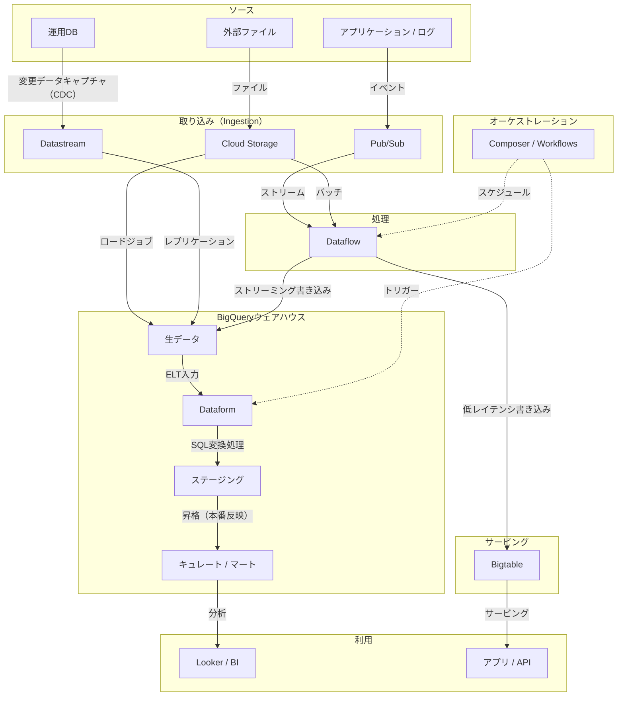

# GCP データエンジニア

このページは、学ぶ内容と練習内容のインデックスとして使う。目的はサービスの暗記ではなく、GCP上でデータパイプラインを設計・構築・運用・保護できるようになること。

## 到達目標
- バッチパイプライン（files -> warehouse）とストリーミングパイプライン（events -> warehouse/serving）を構築できる。
- 信頼性を前提に設計できる：冪等性、リトライ、バックフィル／リプレイ、遅延データの扱い。
- コストを制御できる：ストレージのライフサイクル、クエリのスキャンバイト、コンピュートの適正サイジング、ワークロード分離。
- アクセスを統制できる：最小権限の [[Security/IAM|IAM]]、機微データの取り扱い、監査、メタデータ。

## 推奨学習順
1) 基礎（GCPリソースモデル + データ基礎）
2) ストレージ + ウェアハウス（[[Cloud-Storage|GCS]] + [[Storage/BigQuery|BigQuery]]）
3) バッチ取り込み + ELT（load -> transform -> publish）
4) ストリーミング取り込み + 処理（[[Ingestion/PubSub|Pub/Sub]] -> [[Processing/Dataflow|Dataflow]] -> sinks）
5) オーケストレーション + 運用 + ガバナンス（本番運用できる形にする）

## 参照アーキテクチャ（メンタルモデル）

## どのサービスを選ぶか？

### ストレージ / データベース
- 大規模データセットで **アドホックなSQL分析** が必要 → [[Storage/BigQuery|BigQuery]]
- **高スループット・低レイテンシのキー検索**（時系列、IoT、ワイド行）が必要 → [[OperationalDBs/Bigtable|Bigtable]]
- **リレーショナルOLTP**、中規模、既存Postgres/MySQLが前提 → [[Cloud-SQL|Cloud-SQL]] または [[OperationalDBs/AlloyDB|AlloyDB]]（より高性能ならAlloyDB）
- 強整合の **グローバル分散リレーショナル** が必要 → [[OperationalDBs/Spanner|Spanner]]
- 半構造、モバイル/ウェブ、リアルタイム同期向けの **ドキュメントストア** が必要 → [[OperationalDBs/Firestore|Firestore]]
- DB負荷低減のための **インメモリキャッシュ**、セッションストアが必要 → [[OperationalDBs/Memorystore|Memorystore]]

### 処理
- **1つのAPIでストリーミング/バッチ**（Apache Beam）、フルマネージドが必要 → [[Processing/Dataflow|Dataflow]]
- **Spark/Hadoopエコシステム**、既存Sparkジョブ、大規模データのMLが必要 → [[Processing/Dataproc|Dataproc]]
- BigQuery内で **SQLだけの変換**（ELT、増分モデル）が必要 → [[Processing/Dataform|Dataform]]

### 取り込み
- **リアルタイムイベントストリーミング**、プロデューサ/コンシューマ分離が必要 → [[Ingestion/PubSub|Pub/Sub]]
- **既存OLTPデータベースからのCDC**（継続レプリケーション）が必要 → [[Ingestion/Datastream|Datastream]]
- 外部システムからの **大量ファイル取り込み** が必要 → [[Cloud-Storage|Cloud Storage]] に着地 + BigQueryロード

### オーケストレーション
- **複雑な複数ステップのパイプライン**、システム横断の依存関係、既存Airflowが前提 → [[Cloud-Composer|Cloud-Composer]]
- **軽量なサーバレス・ワークフロー**、HTTPベース連携、シンプルなDAGが必要 → [[Orchestration/Workflows|Workflows]]

---

## ドメイン別学習マップ
| ドメイン             | 学ぶこと                                                                                   | GCPサービス / ノート                                                                                  |
| ------------------ | ----------------------------------------------------------------------------------------- | ----------------------------------------------------------------------------------------------------- |
| 基礎                | 組織/プロジェクト、リージョン、クォータ、サービスアカウント；OLTP vs OLAP；スキーマ；データ品質 | [[Security/IAM\|IAM]]                                                                                 |
| ストレージ          | オブジェクト命名、ロケーション、ライフサイクル、アクセスパターン                             | [[Cloud-Storage\|Cloud Storage]]                                                              |
| ウェアハウス        | パーティショニング/クラスタリング、取り込み、ビュー/マテリアライズドビュー、コストモデル       | [[Storage/BigQuery\|BigQuery]]                                                                        |
| 取り込み            | 配信セマンティクス、リトライ/DLQ、CDC基礎、ファイル形式                                      | [[Ingestion/PubSub\|Pub/Sub]], [[Ingestion/Datastream\|Datastream]]                                   |
| 処理                | バッチ vs ストリーミング変換、ウィンドウ、ウォーターマーク、ステート                          | [[Processing/Dataflow\|Dataflow]], [[Processing/Dataproc\|Dataproc]], [[Processing/Dataform\|Dataform]] |
| オーケストレーション | スケジューリング、リトライ/バックフィル、シークレット、依存関係                               | [[Cloud-Composer\|Cloud Composer]], [[Orchestration/Workflows\|Workflows]]              |
| モデリング/サービング | ディメンショナルモデリング、増分モデル、キュレート済みデータセット                             | [[Storage/BigQuery\|BigQuery]], [[Analytics Consumption/Looker\|Looker]]                              |
| 運用DB              | OLTP基礎、HA、接続パターン、整合性のトレードオフ（Spannerでグローバル）                       | [[Cloud-SQL\|Cloud SQL]], [[OperationalDBs/AlloyDB\|AlloyDB]], [[OperationalDBs/Spanner\|Spanner]], [[OperationalDBs/Firestore\|Firestore]], [[OperationalDBs/Memorystore\|Memorystore]] |
| ガバナンス/品質      | メタデータ、リネージ、データコントラクト、鮮度/完全性チェック                                 | [[Governance/Dataplex\|Dataplex]], [[Data-Catalog\|Data Catalog]]                          |
| セキュリティ         | 最小権限、CMEK/KMS、シークレット、監査、DLP概念                                               | [[Cloud-KMS\|Cloud KMS]], [[Secret-Manager\|Secret Manager]], [[Security/DLP\|DLP]], [[VPC-Service-Controls\|VPC Service Controls]] |
| 運用/コスト          | 監視、アラート、インシデント対応、コスト制御/キャパシティ計画                                  | [[Cloud-Monitoring\|Cloud Monitoring]], [[Cloud-Logging\|Cloud Logging]]  |

## サービス比較表

### 処理：Dataflow vs Dataproc vs Dataform

| 観点             | [[Processing/Dataflow\|Dataflow]]             | [[Processing/Dataproc\|Dataproc]]           | [[Processing/Dataform\|Dataform]]           |
| ---------------- | --------------------------------------------- | ------------------------------------------- | ------------------------------------------- |
| パラダイム        | Apache Beam（バッチ + ストリーム統合）         | Spark / Hadoopエコシステム                   | BigQuery内のSQLベースELT                    |
| 最適             | 新規パイプライン、ストリーミング、サーバレス    | 既存Sparkジョブ、大規模データのML             | SQL変換、BigQuery増分モデル                  |
| サーバ管理        | フルマネージド / サーバレス                    | マネージドクラスタ（サイズ設計は自分）        | サーバレス（BigQuery内で実行）              |
| 言語             | Python / Java（Beam）                         | PySpark / Scala / SparkSQL                  | SQL + JavaScript（SQLX）                    |
| ストリーミング     | ✓ ネイティブ（ウィンドウ、ウォーターマーク、ステート） | ✓ Spark Streaming（より複雑）          | ✗ バッチのみ                                |
| コールドスタート    | 中（ワーカーのプロビジョニング）               | 遅い（クラスタ起動）または事前ウォーム        | 速い（BigQueryネイティブ）                  |
| コストモデル       | vCPU-hr課金 + shuffle                         | vCPU-hr課金（クラスタ稼働時間）               | BigQueryスロット消費                         |

### データベース：適切なストアの選び方

| 観点    | [[Storage/BigQuery\|BigQuery]] | [[OperationalDBs/Bigtable\|Bigtable]] | [[Cloud-SQL\|Cloud SQL]] | [[OperationalDBs/Spanner\|Spanner]] | [[OperationalDBs/Firestore\|Firestore]] |
| ----- | ------------------------------ | ------------------------------------- | ------------------------ | ----------------------------------- | --------------------------------------- |
| 種別    | 分析用ウェアハウス                      | ワイドカラムNoSQL                           | リレーショナルOLTP              | リレーショナル（グローバル）                      | ドキュメントNoSQL                             |
| 整合性   | 結果整合の読み取り                      | 行単位の強整合                               | 強整合（単一リージョン）             | 外部整合（TrueTime）                      | 強整合（ドキュメント単位）                           |
| スケール  | PB（分析）                         | PB（運用）                                | TB（垂直 + リードレプリカ）         | PB（グローバル）                           | TB（自動スケール）                              |
| レイテンシ | 秒（クエリ）                         | 1桁ms                                  | ms（OLTP）                 | ms（OLTP、グローバル）                      | ms（ドキュメント参照）                            |
| スキーマ  | カラムナ、ネスト/繰り返し                  | スキーマレス（カラムファミリ）                       | 固定のリレーショナルスキーマ           | 固定のリレーショナルスキーマ                      | 柔軟（JSON風ドキュメント）                         |
| 典型用途  | 分析、BI、ML特徴量                    | IoT、時系列、アドテク                          | ERP、CMS、トランザクションアプリ      | 金融、在庫（グローバル）                        | モバイル/ウェブ、リアルタイム同期                       |

## よくあるアンチパターン（やってはいけないこと）

| アンチパターン                                                                           | なぜダメか                                               | 正しいアプローチ                                                                                                                                        |
| --------------------------------------------------------------------------------------- | -------------------------------------------------------- | -------------------------------------------------------------------------------------------------------------------------------------------------------- |
| OLTP（高頻度のポイント書き込み）に [[Storage/BigQuery\|BigQuery]] を使う                 | BQは分析用途で、DML更新は高コストかつ遅い                 | トランザクション用途は [[Cloud-SQL\|Cloud SQL]]、[[OperationalDBs/Spanner\|Spanner]]、[[OperationalDBs/Firestore\|Firestore]] を使う                     |
| BigQueryで `SELECT *` を使う                                                            | 全列をスキャン → スロット枠を無駄にし、コストが増える      | 必要な列だけを選ぶ（列プルーニング）                                                                                                                    |
| [[Ingestion/PubSub\|Pub/Sub]] サブスクリプションにデッドレターキュー（DLQ）がない        | 毒メッセージが処理を無期限に止める                        | デッドレタートピック + 最大配信試行回数を必ず設定する                                                                                                     |
| バッチロードに冪等性がない                                                               | 失敗ジョブを再実行すると行が重複する                      | `WRITE_TRUNCATE` や `MERGE` パターンを使い、再実行可能な設計にする                                                                                        |
| パイプラインコードに認証情報をハードコードする                                           | 認証情報がログ、VCS、コンテナイメージに漏れる             | [[Secret-Manager\|Secret Manager]] または Workload Identity / サービス アカウントの代行（impersonation）を使う                                          |
| BigQueryテーブルを過度にパーティション分割する（小さいパーティションが多すぎる）         | パーティションプルーニングのオーバーヘッド、メタデータ費用が増える | 日付/整数レンジはカーディナリティが管理可能な範囲でのみ使い、高カーディナリティはクラスタリングで対応する                                               |
| 重要なパイプラインデータに単一リージョンの [[Cloud-Storage\|Cloud Storage]] を使う        | 単一障害点になり、リージョン間DRがない                     | 事業クリティカルなデータはマルチリージョンまたはデュアルリージョンのバケットを使う                                                                       |
| SQLだけの変換のために [[Processing/Dataproc\|Dataproc]] クラスタを動かす                 | 高コスト、起動が遅い、アイドルでもクラスタ費用が発生する   | ELTは [[Processing/Dataform\|Dataform]] または BigQuery SQL を直接使う                                                                                   |
| [[Processing/Dataflow\|Dataflow]] のストリーミングでウォーターマークを設定しない         | 遅延データが黙って捨てられる／ステートが無制限に増える     | 許容遅延（allowed lateness）と明示的なウォーターマーク戦略を必ず設定する                                                                                 |
| パイプラインにOwner/Editorロールを付与する                                               | 最小権限に反し、影響範囲（blast radius）が大きすぎる       | リソースごとに必要最小限の [[Security/IAM\|IAM]] ロールだけを付与する                                                                                    |
